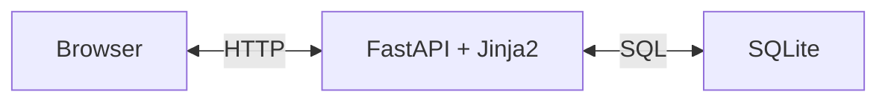
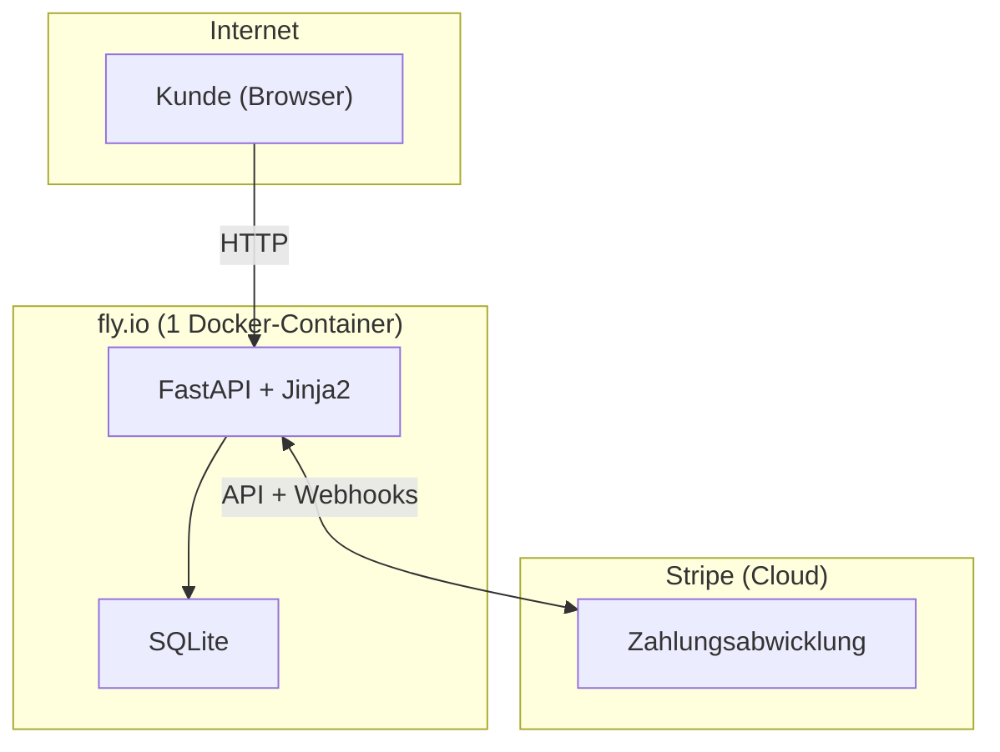

[← Übersicht](index.md)

# arc42 Architekturdokumentation — Olivalle Webshop

> Vorlage basierend auf [arc42](https://arc42.org), Version 8.
> Erstellt für ein Einzelunternehmen in der Schweiz.

---

## 1. Einführung und Ziele

### Was ist Olivalle?
Olivalle ist ein Online-Shop für biologisches Olivenöl, importiert aus Andalusien, Spanien. Betrieben als Hobby-Projekt eines Einzelunternehmers in der Schweiz mit geplantem Produktivbetrieb.

### Produkte
| Produkt | Preis |
|---|---|
| 250ml Flasche | CHF 8 |
| 750ml Flasche | CHF 18 |
| 3l Kanister | CHF 50 |

### Wesentliche Ziele
1. Bestellprozess vollständig digitalisieren (ersetzt manuelles Tally-Formular)
2. Zahlungen via Stripe (Twint + Kreditkarte) abwickeln
3. Administrativen Aufwand für den Betreiber minimieren

### Funktionale Anforderungen

| Nr. | Als … | möchte ich … | damit … |
|---|---|---|---|
| FA-001 | Kunde | alle Produkte mit Preis und Beschreibung sehen | ich informiert entscheiden kann |
| FA-002 | Kunde | Produkte in einen Warenkorb legen | ich mehrere Artikel auf einmal bestellen kann |
| FA-003 | Kunde | meine Lieferadresse eingeben | die Bestellung zugestellt werden kann |
| FA-004 | Kunde | zwischen Postversand und Abholung in der Region Olten wählen | ich die passende Option nutzen kann |
| FA-005 | Kunde | per Twint bezahlen | ich die in der Schweiz übliche Zahlungsmethode nutzen kann |
| FA-006 | Kunde | per Kreditkarte bezahlen | ich eine Alternative zu Twint habe |
| FA-007 | Kunde | eine Bestellbestätigung per E-Mail erhalten | ich die Bestellung nachvollziehen kann |
| FA-008 | Kunde | eine QR-Rechnung als PDF erhalten | ich alternativ per Banküberweisung zahlen kann |

---

## 2. Randbedingungen

### Technische Randbedingungen
| Bedingung | Erläuterung |
|---|---|
| Schweizer Zahlungsmittel | Twint muss unterstützt werden |
| QR-Rechnung | Schweizer Standard, Pflicht für Rechnungsstellung |
| SSL-Zertifikat | Muss vor Launch auf olivalle.ch erneuert werden |
| Günstiges Hosting | Kein eigener Server, managed Services bevorzugt |

### Organisatorische Randbedingungen
| Bedingung | Erläuterung |
|---|---|
| Einzelunternehmer | Kein Team, minimaler Betriebsaufwand |
| Schweizer Recht | MWST-Pflicht ab CHF 100'000 Umsatz prüfen |
| Datenschutz | Schweizer DSG (Datenschutzgesetz) beachten |
| Budget | Hobby-Projekt, kostenlose/günstige Tiers bevorzugt |

### Entwicklungsrandbedingungen
| Bedingung | Erläuterung |
|---|---|
| Entwickler-Kenntnisse | Python und SQL vorhanden |
| Erstes Webprojekt | Schrittweises Vorgehen, keine Over-Engineering |

---

## 3. Kontextabgrenzung

→ Siehe [systemarchitektur.md](systemarchitektur.md)

### Externe Systeme
| System | Zweck | Schnittstelle |
|---|---|---|
| Stripe | Zahlungsabwicklung (Karte, Twint) | REST API + Webhooks |
| fly.io | Hosting (1 Docker-Container) | Docker Deployment |
| Brevo (ehem. Sendinblue) | Bestellbestätigungen versenden | REST API |
| swiss-qr-bill | QR-Rechnungen generieren | Python-Bibliothek (lokal) |

---

## 4. Lösungsstrategie

### Kernentscheidungen
| Entscheidung | Gewählte Lösung | Begründung |
|---|---|---|
| Backend/API | Python + FastAPI | Entwickler kennt Python; saubere REST-API-Struktur |
| Frontend | Jinja2-Templates + Tailwind CSS | Kein zweites Framework, alles Python, HTML-Templates reichen für 3 Produkte |
| Datenbank | SQLite | Eine Datei, kein separater Service, reicht für ~100 Bestellungen/Mt |
| Zahlungen | Stripe | Twint-Support in CH, einfache Integration |
| QR-Rechnung | swiss-qr-bill (Open Source) | Direkt im Code, kein teures Drittsystem nötig |
| Hosting | fly.io (1 Docker-Container) | Günstig (~$5/Mt), kommerziell erlaubt |

### Architekturprinzipien
- **Einfachheit vor Vollständigkeit** — kein Over-Engineering für ein Hobby-Projekt
- **Alles in einem Container** — FastAPI liefert HTML, API und statische Dateien
- **SQLite statt Cloud-DB** — weniger Abhängigkeiten, Backup via Litestream

---

## 5. Bausteinsicht

### Ebene 1 — Gesamtsystem


### Ebene 2 — Seiten (Jinja2-Templates)
| Baustein | Aufgabe |
|---|---|
| Produktseite | Produkte aus DB laden und rendern |
| Warenkorb | Artikel verwalten (Vanilla JS + localStorage) |
| Checkout | Adressformular, Versandwahl, Weiterleitung zu Stripe Checkout |
| Bestellbestätigung | Erfolgsmeldung nach Zahlung |

### Ebene 2 — Backend (FastAPI)
| Baustein | Aufgabe |
|---|---|
| `GET /produkte` | Produktliste aus DB zurückgeben |
| `POST /bestellung` | Neue Bestellung anlegen, Stripe Payment Intent erstellen |
| `POST /webhook/stripe` | Zahlungsstatus empfangen, Bestellung aktualisieren |
| E-Mail-Service | Bestätigungsmail nach erfolgreicher Zahlung versenden |
| QR-Rechnungs-Service | PDF-Rechnung mit swiss-qr-bill generieren |

### Paketstruktur

Die Paketstruktur folgt der gewählten Schichtenarchitektur (siehe ADR-005). Jede Schicht hat einen eigenen Ordner mit klar abgegrenzter Verantwortung.

**App (FastAPI / Python)**
```
app/
├── main.py              # App-Einstiegspunkt, FastAPI-Instanz
├── config.py            # Konfiguration und Umgebungsvariablen
├── routers/             # Präsentationsschicht: API-Endpunkte + Seiten
│   ├── pages.py         #   HTML-Seiten (Produkte, Warenkorb, Checkout)
│   ├── bestellungen.py  #   POST /bestellung
│   └── webhooks.py      #   POST /webhook/stripe
├── services/            # Geschäftslogik
│   ├── bestell_service.py
│   ├── email_service.py
│   └── qr_service.py
├── repositories/        # Datenzugriffsschicht (SQL via SQLite)
│   ├── produkt_repo.py
│   └── bestell_repo.py
└── models/              # Datenmodelle (Pydantic Schemas)
    ├── produkt.py
    ├── kunde.py
    └── bestellung.py
```

**Templates & Static**
```
templates/               # Jinja2-Templates
├── base.html            # Globales Layout
├── produkte.html        # Produktliste
├── warenkorb.html       # Warenkorb
├── checkout.html        # Checkout-Formular
└── bestaetigung.html    # Bestellbestätigung
static/                  # CSS, JS, Bilder
├── css/
├── js/
└── img/
```

---

## 6. Laufzeitsicht

→ Siehe [bestellprozess.md](bestellprozess.md)

### Wichtige Laufzeitszenarien
- **Normaler Kauf:** Kunde wählt Produkte → Checkout → Stripe Checkout (Redirect) → Webhook → Bestätigung
- **QR-Rechnung:** Nach Bestellung wird PDF generiert und per E-Mail mitgeschickt

---

## 7. Verteilungssicht



### Hosting-Kosten (geschätzt)
| Service | Kosten | Wann Upgrade nötig |
|---|---|---|
| fly.io | ~$5/Mt (1 Container) | Bei mehr Traffic: Scale Up |
| Stripe | 1.5% + CHF 0.30 pro Transaktion (CH) | — |
| Brevo (E-Mail) | Gratis (9'000 Mails/Mt, max. 300/Tag) | Ab ~9'000 Mails/Mt: €9/Mt |

**Fazit für den Betreiber:** Fixkosten ca. $5/Mt für fly.io plus Stripe-Gebühren pro Transaktion. Deutlich günstiger als der vorherige Multi-Service-Ansatz.

### Build-Prozess
Das Docker-Image wird als Multi-Stage-Build erzeugt: Eine Node-Stage kompiliert Tailwind CSS zur Build-Zeit zu einer statischen Datei (`static/css/app.css`), die Python-Stage kopiert nur das fertige CSS-Artefakt. Dadurch wird kein Tailwind-CDN und keine Runtime-JIT mehr benötigt — die Content Security Policy kommt ohne `unsafe-eval` aus.

---

## 8. Querschnittliche Konzepte

### Sicherheit
- HTTPS überall (fly.io erzwingt SSL)
- Stripe Webhook-Signatur verifizieren (kein direktes Vertrauen in Webhook-Daten)
- CSRF-Schutz für alle POST-Formulare: Tokens an pro-Nutzer Identity gebunden — Admin-Routen an `sha256(admin_session)`, anonyme Routen an ein `csrf_id`-Cookie (Double-Submit). Tokens sind dadurch nicht universell wiederverwendbar (Issue #77).
- Rate-Limit (in-memory, sliding window): 10 Requests/Min auf `/bestellen`, 5/Min auf `/admin/login`
- BruteForceGuard auf `/admin/login` (Lockout nach 5 Fehlversuchen)
- `.env`-Dateien nie ins Repository committen

### Fehlerbehandlung
- Fehlgeschlagene Zahlungen: Stripe gibt Fehlermeldung zurück → im Frontend anzeigen
- Webhook-Fehler: Stripe wiederholt Webhooks automatisch bei Fehlern

### Datenschutz (DSG)
- Kundendaten nur für Bestellabwicklung speichern
- Keine Weitergabe an Dritte ausser Stripe (Zahlungsabwicklung)
- Datenschutzerklärung auf der Website notwendig

---

## 9. Architekturentscheidungen

### ADR-001: Python/FastAPI für alles (Backend + Frontend)
**Kontext:** Entwickler kennt Python gut, JavaScript/React neu und nicht nötig.
**Entscheidung:** FastAPI als Backend + Jinja2-Templates statt separatem Frontend-Framework.
**Konsequenz:** Eine Sprache (Python), kein Build-Schritt für Frontend, einfacheres Deployment.

### ADR-002: SQLite statt Managed PostgreSQL
**Kontext:** Kleines Projekt (~100 Bestellungen/Mt), kein Interesse an Datenbankadministration.
**Entscheidung:** SQLite als eingebettete Datenbank (eine Datei).
**Konsequenz:** Kein separater Datenbank-Service nötig, Backup via Litestream. Bei starkem Wachstum Migration zu PostgreSQL möglich.

### ADR-003: Stripe Checkout (Redirect) für Zahlungen
**Kontext:** Twint ist in der Schweiz weit verbreitet und muss unterstützt werden.
**Entscheidung:** Stripe Checkout als Redirect (kein eingebettetes Zahlungsformular).
**Konsequenz:** Alle Zahlungsmethoden über einen Anbieter, PCI-Compliance an Stripe delegiert.

### ADR-005: Architekturmuster — Klassische Schichtenarchitektur
**Kontext:** Für das Backend standen folgende Muster zur Wahl: modularer Monolith, Hexagonale Architektur, DDD/Microservices, klassische Schichtenarchitektur oder ein Mix davon.
**Entscheidung:** Klassische Schichtenarchitektur (Layered Architecture) für das FastAPI-Backend.
Die vier Schichten sind: Routers (Präsentation) → Services (Geschäftslogik) → Repositories (Datenzugriff) → Models (Domäne).
**Begründung:** Das Projekt ist ein kleiner Webshop mit einem Einzelentwickler. Hexagonale Architektur und DDD wären für diesen Umfang überdimensioniert und erhöhen die Einstiegshürde unnötig. Die Schichtenarchitektur ist gut dokumentiert, wird von FastAPI natürlich unterstützt (Router-Modell) und erlaubt trotzdem saubere Trennung von Verantwortlichkeiten.
**Konsequenz:** Klare, einfach nachvollziehbare Struktur. Kein Overhead durch abstrakte Ports/Adapter oder Domain-Events. Bei starkem Wachstum wäre eine spätere Migration zu Hexagonal möglich.

### ADR-004: QR-Rechnung direkt im Code (swiss-qr-bill)
**Kontext:** Alternativen wie Bexio kosten monatlich und sind überdimensioniert.
**Entscheidung:** Open-Source-Bibliothek swiss-qr-bill direkt im FastAPI-Backend.
**Konsequenz:** Mehr Eigenverantwortung, aber kostenlos und flexibel.

---

## 10. Qualitätsanforderungen

| Qualitätsziel | Szenario | Priorität |
|---|---|---|
| Zuverlässigkeit | Bestellungen dürfen nicht verloren gehen | Hoch |
| Datenschutz | Kundendaten sicher speichern (DSG) | Hoch |
| Bedienbarkeit | Checkout in unter 3 Minuten abschliessbar | Mittel |
| Wartbarkeit | Einzelperson kann den Code pflegen | Mittel |
| Performance | Produktseite lädt in unter 2 Sekunden | Niedrig |

---

## 11. Risiken und technische Schulden

| Risiko | Wahrscheinlichkeit | Auswirkung | Massnahme |
|---|---|---|---|
| SSL-Zertifikat abgelaufen (olivalle.ch) | Eingetreten | Hoch | Vor Launch erneuern |
| MWST-Pflicht bei Wachstum | Niedrig | Mittel | Ab CHF 100k Umsatz prüfen |
| Stripe-Gebühren bei hohem Volumen | Niedrig | Mittel | Konditionen regelmässig prüfen |
| SQLite-Datenverlust | Mittel | Hoch | Backup via Litestream einrichten |
| Einzelentwickler-Abhängigkeit | Hoch | Mittel | Gute Dokumentation, einfacher Code |

---

## 12. Glossar

| Begriff | Erklärung |
|---|---|
| **Twint** | Schweizer Mobile-Payment-App, weit verbreitet in der CH |
| **QR-Rechnung** | Schweizer Standard für Zahlungsscheine mit QR-Code, seit 2022 Pflicht |
| **DSG** | Datenschutzgesetz (Schweiz), vergleichbar mit der EU-DSGVO |
| **MWST** | Mehrwertsteuer (Schweiz), aktuell 8.1% Normalsatz |
| **Stripe Webhook** | Automatische HTTP-Benachrichtigung von Stripe nach einer Zahlung |
| **Payment Intent** | Stripe-Objekt das eine Zahlungsabsicht repräsentiert |
| **swiss-qr-bill** | Open-Source Python-Bibliothek zur Generierung von QR-Rechnungen |
| **FastAPI** | Modernes Python Web-Framework für REST-APIs |
| **Jinja2** | Template-Engine für Python, rendert HTML serverseitig |
| **SQLite** | Eingebettete Datenbank, gespeichert als einzelne Datei |
| **fly.io** | Cloud-Plattform für Docker-Container-Hosting |
| **Litestream** | Tool für kontinuierliches SQLite-Backup in die Cloud |
