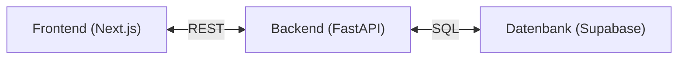
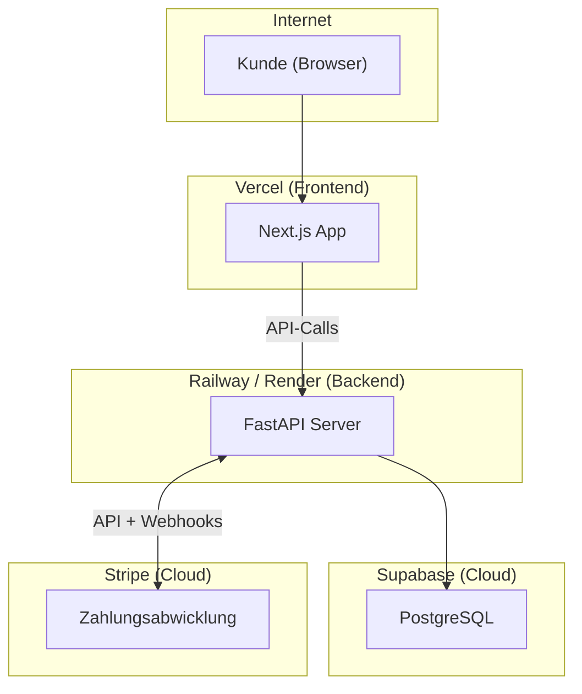

[← Übersicht](index.md)

# arc42 Architekturdokumentation — Olivalle Webshop

> Vorlage basierend auf [arc42](https://arc42.org), Version 8.
> Erstellt für ein Einzelunternehmen in der Schweiz.

---

## 1. Einführung und Ziele

### Was ist Olivalle?
Olivalle ist ein Online-Shop für biologisches Olivenöl, importiert aus Andalusien, Spanien. Betrieben als Hobby-Projekt eines Einzelunternehmers in der Schweiz mit geplantem Produktivbetrieb.

### Produkte
| Produkt | Preis |
|---|---|
| 250ml Flasche | CHF 8 |
| 750ml Flasche | CHF 18 |
| 3l Kanister | CHF 50 |

### Wesentliche Ziele
1. Bestellprozess vollständig digitalisieren (ersetzt manuelles Tally-Formular)
2. Zahlungen via Stripe (Twint + Kreditkarte) abwickeln
3. Administrativen Aufwand für den Betreiber minimieren
4. Wiederkehrende Lieferungen / Abonnements ermöglichen

---

## 2. Randbedingungen

### Technische Randbedingungen
| Bedingung | Erläuterung |
|---|---|
| Schweizer Zahlungsmittel | Twint muss unterstützt werden |
| QR-Rechnung | Schweizer Standard, Pflicht für Rechnungsstellung |
| SSL-Zertifikat | Muss vor Launch auf olivalle.ch erneuert werden |
| Günstiges Hosting | Kein eigener Server, managed Services bevorzugt |

### Organisatorische Randbedingungen
| Bedingung | Erläuterung |
|---|---|
| Einzelunternehmer | Kein Team, minimaler Betriebsaufwand |
| Schweizer Recht | MWST-Pflicht ab CHF 100'000 Umsatz prüfen |
| Datenschutz | Schweizer DSG (Datenschutzgesetz) beachten |
| Budget | Hobby-Projekt, kostenlose/günstige Tiers bevorzugt |

### Entwicklungsrandbedingungen
| Bedingung | Erläuterung |
|---|---|
| Entwickler-Kenntnisse | Python und SQL vorhanden, JavaScript/React neu |
| Erstes Webprojekt | Schrittweises Vorgehen, keine Over-Engineering |

---

## 3. Kontextabgrenzung

→ Siehe [systemarchitektur.md](systemarchitektur.md)

### Externe Systeme
| System | Zweck | Schnittstelle |
|---|---|---|
| Stripe | Zahlungsabwicklung (Karte, Twint, Abos) | REST API + Webhooks |
| Supabase | Managed PostgreSQL Datenbank | REST API / SQL |
| Vercel | Frontend-Hosting (Next.js) | Git-basiertes Deployment |
| Railway / Render | Backend-Hosting (FastAPI) | Docker / Git Deployment |
| E-Mail-Dienst | Bestellbestätigungen versenden | SMTP / API |
| swiss-qr-bill | QR-Rechnungen generieren | Python-Bibliothek (lokal) |

---

## 4. Lösungsstrategie

### Kernentscheidungen
| Entscheidung | Gewählte Lösung | Begründung |
|---|---|---|
| Frontend | Next.js 15 (App Router) | SEO, Server-Side Rendering, Full-Stack in einem Repo |
| Backend | Python + FastAPI | Entwickler kennt Python; saubere REST-API-Struktur |
| Datenbank | Supabase (PostgreSQL) | Managed, günstiger Free-Tier, vertrautes SQL |
| Zahlungen | Stripe | Twint-Support in CH, einfache Integration, Abo-Funktion |
| QR-Rechnung | swiss-qr-bill (Open Source) | Direkt im Code, kein teures Drittsystem nötig |
| Styling | Tailwind CSS + shadcn/ui | Schnell, konsistent, keine eigene Design-System-Pflege |

### Architekturprinzipien
- **Einfachheit vor Vollständigkeit** — kein Over-Engineering für ein Hobby-Projekt
- **Managed Services bevorzugt** — kein eigener Server-Betrieb
- **API-First** — Frontend und Backend strikt getrennt via REST

---

## 5. Bausteinsicht

### Ebene 1 — Gesamtsystem

### Ebene 2 — Frontend (Next.js)
| Baustein | Aufgabe |
|---|---|
| Produktseite | Produkte aus API laden und anzeigen |
| Warenkorb | Artikel verwalten (React State) |
| Checkout | Adressformular, Versandwahl, Stripe-Zahlungsformular |
| Bestellbestätigung | Erfolgsmeldung nach Zahlung |

### Ebene 2 — Backend (FastAPI)
| Baustein | Aufgabe |
|---|---|
| `GET /produkte` | Produktliste aus DB zurückgeben |
| `POST /bestellung` | Neue Bestellung anlegen, Stripe Payment Intent erstellen |
| `POST /webhook/stripe` | Zahlungsstatus empfangen, Bestellung aktualisieren |
| E-Mail-Service | Bestätigungsmail nach erfolgreicher Zahlung versenden |
| QR-Rechnungs-Service | PDF-Rechnung mit swiss-qr-bill generieren |

---

## 6. Laufzeitsicht

→ Siehe [bestellprozess.md](bestellprozess.md)

### Wichtige Laufzeitszenarien
- **Normaler Kauf:** Kunde wählt Produkte → Checkout → Stripe-Zahlung → Webhook → Bestätigung
- **Abonnement:** Stripe Billing löst wiederkehrende Zahlung aus → Webhook → Lieferung auslösen
- **QR-Rechnung:** Nach Bestellung wird PDF generiert und per E-Mail mitgeschickt

---

## 7. Verteilungssicht

### Hosting-Kosten (geschätzt)
| Service | Free Tier | Paid |
|---|---|---|
| Vercel | Kostenlos für Hobby | ab $20/Mt |
| Railway | $5 Credit/Mt gratis | ab $5/Mt |
| Supabase | 500 MB gratis | ab $25/Mt |
| Stripe | Keine Grundgebühr | 1.5% + CHF 0.30 pro Transaktion (CH) |

---

## 8. Querschnittliche Konzepte

### Sicherheit
- HTTPS überall (Vercel und Railway erzwingen SSL)
- Stripe Webhook-Signatur verifizieren (kein direktes Vertrauen in Webhook-Daten)
- Keine Kundendaten im Frontend-State speichern die nicht nötig sind
- `.env`-Dateien nie ins Repository committen

### Fehlerbehandlung
- Fehlgeschlagene Zahlungen: Stripe gibt Fehlermeldung zurück → im Frontend anzeigen
- Webhook-Fehler: Stripe wiederholt Webhooks automatisch bei Fehlern

### Datenschutz (DSG)
- Kundendaten nur für Bestellabwicklung speichern
- Keine Weitergabe an Dritte ausser Stripe (Zahlungsabwicklung)
- Datenschutzerklärung auf der Website notwendig

---

## 9. Architekturentscheidungen

### ADR-001: Python/FastAPI statt Node.js Backend
**Kontext:** Entwickler kennt Python gut, JavaScript weniger.
**Entscheidung:** FastAPI als Backend-Framework.
**Konsequenz:** Zwei verschiedene Sprachen im Stack (Python + TypeScript), aber bessere Entwicklerproduktivität.

### ADR-002: Supabase statt selbst gehostetem PostgreSQL
**Kontext:** Kein Interesse an Datenbankadministration.
**Entscheidung:** Supabase als Managed Service.
**Konsequenz:** Abhängigkeit von Drittem, aber kein Betriebsaufwand, Web-UI für Datenverwaltung inklusive.

### ADR-003: Stripe für alle Zahlungen
**Kontext:** Twint ist in der Schweiz weit verbreitet und muss unterstützt werden.
**Entscheidung:** Stripe, da Twint nativ unterstützt wird.
**Konsequenz:** Alle Zahlungsmethoden über einen Anbieter, vereinfacht Buchhaltung.

### ADR-004: QR-Rechnung direkt im Code (swiss-qr-bill)
**Kontext:** Alternativen wie Bexio kosten monatlich und sind überdimensioniert.
**Entscheidung:** Open-Source-Bibliothek swiss-qr-bill direkt im FastAPI-Backend.
**Konsequenz:** Mehr Eigenverantwortung, aber kostenlos und flexibel.

---

## 10. Qualitätsanforderungen

| Qualitätsziel | Szenario | Priorität |
|---|---|---|
| Zuverlässigkeit | Bestellungen dürfen nicht verloren gehen | Hoch |
| Datenschutz | Kundendaten sicher speichern (DSG) | Hoch |
| Bedienbarkeit | Checkout in unter 3 Minuten abschliessbar | Mittel |
| Wartbarkeit | Einzelperson kann den Code pflegen | Mittel |
| Performance | Produktseite lädt in unter 2 Sekunden | Niedrig |

---

## 11. Risiken und technische Schulden

| Risiko | Wahrscheinlichkeit | Auswirkung | Massnahme |
|---|---|---|---|
| SSL-Zertifikat abgelaufen (olivalle.ch) | Eingetreten | Hoch | Vor Launch erneuern |
| MWST-Pflicht bei Wachstum | Niedrig | Mittel | Ab CHF 100k Umsatz prüfen |
| Stripe-Gebühren bei hohem Volumen | Niedrig | Mittel | Konditionen regelmässig prüfen |
| Supabase Free-Tier-Limit | Niedrig | Niedrig | Auf Paid upgraden falls nötig |
| Einzelentwickler-Abhängigkeit | Hoch | Mittel | Gute Dokumentation, einfacher Code |

---

## 12. Glossar

| Begriff | Erklärung |
|---|---|
| **Twint** | Schweizer Mobile-Payment-App, weit verbreitet in der CH |
| **QR-Rechnung** | Schweizer Standard für Zahlungsscheine mit QR-Code, seit 2022 Pflicht |
| **DSG** | Datenschutzgesetz (Schweiz), vergleichbar mit der EU-DSGVO |
| **MWST** | Mehrwertsteuer (Schweiz), aktuell 8.1% Normalsatz |
| **Stripe Webhook** | Automatische HTTP-Benachrichtigung von Stripe nach einer Zahlung |
| **Payment Intent** | Stripe-Objekt das eine Zahlungsabsicht repräsentiert |
| **Stripe Billing** | Stripe-Produkt für Abonnements und wiederkehrende Zahlungen |
| **swiss-qr-bill** | Open-Source Python-Bibliothek zur Generierung von QR-Rechnungen |
| **App Router** | Modernes Routing-System in Next.js 15 (basiert auf React Server Components) |
| **FastAPI** | Modernes Python Web-Framework für REST-APIs |
| **Supabase** | Managed PostgreSQL-Datenbank als Cloud-Service |
