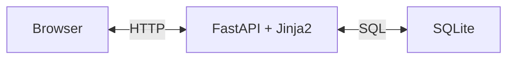
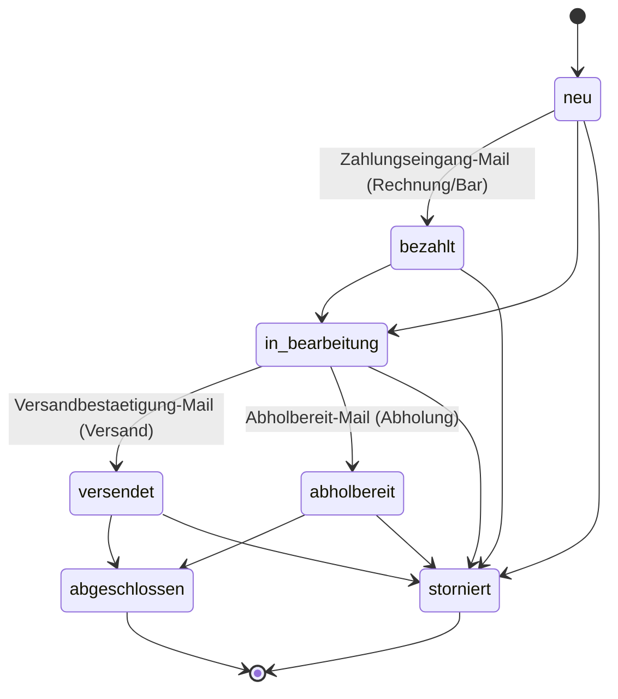
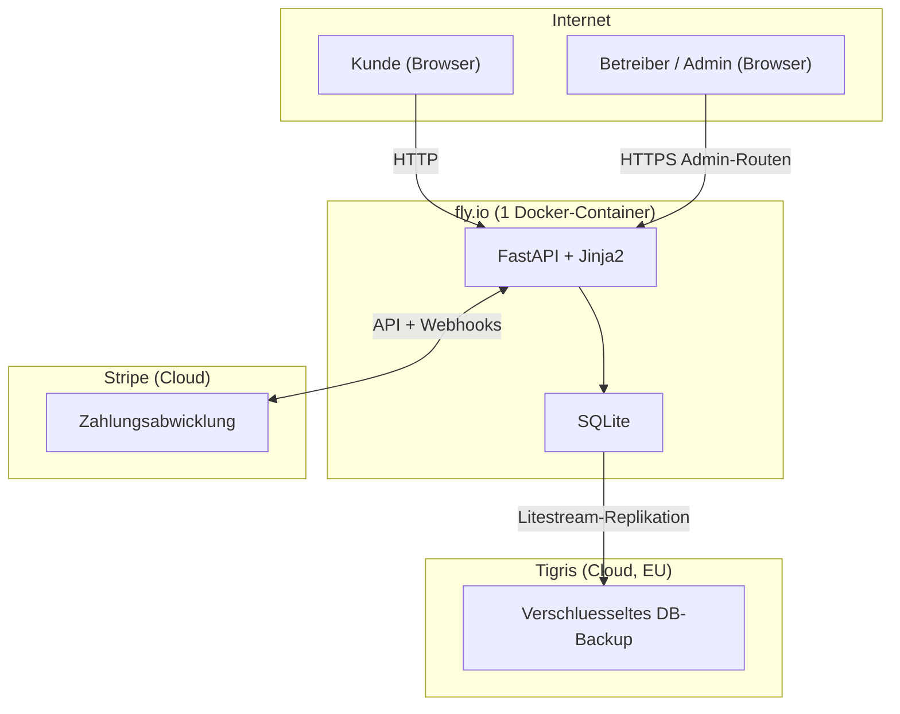

[← Übersicht](index.md)

# arc42 Architekturdokumentation — Olivalle Webshop

> Vorlage basierend auf [arc42](https://arc42.org), Version 8.
> Erstellt für ein Einzelunternehmen in der Schweiz.

---

## 1. Einführung und Ziele

### Was ist Olivalle?
Olivalle ist ein Online-Shop für biologisches Olivenöl, importiert aus Andalusien, Spanien. Betrieben von einem Einzelunternehmer in der Schweiz — live auf [olivalle.ch](https://olivalle.ch) seit April 2026 (Version 1.4.x; die exakt deployte Version zeigen der Footer im Shop und die Git-Tags — bewusst nicht hier hartkodiert, siehe [`ci-cd-und-versionierung.md`](ci-cd-und-versionierung.md)).

### Produkte
| Produkt | Preis |
|---|---|
| 250ml Flasche | CHF 8 |
| 500ml Geschenkflasche | CHF 25 |
| 750ml Flasche | CHF 18 |
| 3l Kanister | CHF 50 |

### Wesentliche Ziele
1. Bestellprozess vollständig digitalisieren (ersetzt manuelles Tally-Formular)
2. Zahlungen via Stripe (Twint + Kreditkarte) abwickeln
3. Administrativen Aufwand für den Betreiber minimieren

### Funktionale Anforderungen

| Nr. | Als … | möchte ich … | damit … |
|---|---|---|---|
| FA-001 | Kunde | alle Produkte mit Preis und Beschreibung sehen | ich informiert entscheiden kann |
| FA-002 | Kunde | Produkte in einen Warenkorb legen | ich mehrere Artikel auf einmal bestellen kann |
| FA-003 | Kunde | meine Lieferadresse eingeben | die Bestellung zugestellt werden kann |
| FA-004 | Kunde | zwischen Postversand und Abholung in der Region Olten wählen | ich die passende Option nutzen kann |
| FA-005 | Kunde | per Twint bezahlen | ich die in der Schweiz übliche Zahlungsmethode nutzen kann |
| FA-006 | Kunde | per Kreditkarte bezahlen | ich eine Alternative zu Twint habe |
| FA-007 | Kunde | eine Bestellbestätigung per E-Mail erhalten | ich die Bestellung nachvollziehen kann |
| FA-008 | Kunde | eine QR-Rechnung als PDF erhalten | ich alternativ per Banküberweisung zahlen kann |

---

## 2. Randbedingungen

### Technische Randbedingungen
| Bedingung | Erläuterung |
|---|---|
| Schweizer Zahlungsmittel | Twint muss unterstützt werden |
| QR-Rechnung | Schweizer Standard, Pflicht für Rechnungsstellung |
| SSL-Zertifikat | Muss vor Launch auf olivalle.ch erneuert werden |
| Günstiges Hosting | Kein eigener Server, managed Services bevorzugt |

### Organisatorische Randbedingungen
| Bedingung | Erläuterung |
|---|---|
| Einzelunternehmer | Kein Team, minimaler Betriebsaufwand |
| Schweizer Recht | MWST-Pflicht ab CHF 100'000 Umsatz prüfen |
| Datenschutz | Schweizer DSG (Datenschutzgesetz) beachten |
| Budget | Hobby-Projekt, kostenlose/günstige Tiers bevorzugt |

### Entwicklungsrandbedingungen
| Bedingung | Erläuterung |
|---|---|
| Entwickler-Kenntnisse | Python und SQL vorhanden |
| Erstes Webprojekt | Schrittweises Vorgehen, keine Over-Engineering |

---

## 3. Kontextabgrenzung

→ Siehe [systemarchitektur.md](systemarchitektur.md)

### Externe Systeme
| System | Zweck | Schnittstelle |
|---|---|---|
| Stripe | Zahlungsabwicklung (Karte, Twint) | REST API + Webhooks |
| fly.io | Hosting (1 Docker-Container) | Docker Deployment |
| Brevo (ehem. Sendinblue) | Bestellbestätigungen versenden | REST API |
| swiss-qr-bill | QR-Rechnungen generieren | Python-Bibliothek (lokal) |

---

## 4. Lösungsstrategie

> Die konsolidierte Begründung aller Kern-Entscheidungen (inkl. verworfener Alternativen) steht in der [Tech-Stack-ADR](adr-tech-stack.md).

### Kernentscheidungen
| Entscheidung | Gewählte Lösung | Begründung |
|---|---|---|
| Backend/API | Python + FastAPI | Entwickler kennt Python; saubere REST-API-Struktur |
| Frontend | Jinja2-Templates + Tailwind CSS | Kein zweites Framework, alles Python, HTML-Templates reichen aus |
| Datenbank | SQLite | Eine Datei, kein separater Service, reicht für ~100 Bestellungen/Mt |
| Zahlungen | Stripe | Twint-Support in CH, einfache Integration |
| QR-Rechnung | swiss-qr-bill (Open Source) | Direkt im Code, kein teures Drittsystem nötig |
| Hosting | fly.io (1 Docker-Container) | Günstig (~$2/Mt real; ursprünglich ~$5/Mt geschätzt), kommerziell erlaubt |

### Architekturprinzipien
- **Einfachheit vor Vollständigkeit** — kein Over-Engineering für ein Hobby-Projekt
- **Alles in einem Container** — FastAPI liefert HTML, API und statische Dateien
- **SQLite statt Cloud-DB** — weniger Abhängigkeiten, Backup via Litestream

---

## 5. Bausteinsicht

### Ebene 1 — Gesamtsystem


### Ebene 2 — Seiten (Jinja2-Templates)
| Baustein | Aufgabe |
|---|---|
| Produktseite | Produkte aus DB laden und rendern |
| Warenkorb | Artikel verwalten (Vanilla JS + localStorage) |
| Checkout | Adressformular, Versandwahl, Weiterleitung zu Stripe Checkout |
| Bestellbestätigung | Erfolgsmeldung nach Zahlung |

### Ebene 2 — Backend (FastAPI)
| Baustein | Aufgabe |
|---|---|
| `GET /` | Startseite mit Produktliste aus DB rendern |
| `POST /bestellen` | Neue Bestellung anlegen; bei Zahlungsart Stripe eine Stripe **Checkout Session** erstellen und auf Stripe Checkout weiterleiten (303) |
| `POST /webhook/stripe` | Drei Stripe-Events verarbeiten: `checkout.session.completed` → `bezahlt`; `checkout.session.expired` / `async_payment_failed` → `storniert` (je mit Audit-Log-Eintrag) |
| E-Mail-Service | Bestätigungsmail nach erfolgreicher Zahlung versenden |
| QR-Rechnungs-Service | PDF-Rechnung mit swiss-qr-bill generieren |

### Paketstruktur

Die Paketstruktur folgt der gewählten Schichtenarchitektur (siehe ADR-005). Jede Schicht hat einen eigenen Ordner mit klar abgegrenzter Verantwortung.

**App (FastAPI / Python)**
```
app/
├── main.py              # App-Einstiegspunkt, FastAPI-Instanz
├── config.py            # Konfiguration und Umgebungsvariablen
├── database.py          # SQLite-Verbindung + Migrationen (init_db)
├── templating.py        # Jinja2-Setup
├── csrf.py              # CSRF-Token-Logik
├── labels.py            # Anzeige-Labels (Status, Zahlungs-/Versandart)
├── client_ip.py         # Client-IP-Ermittlung (Rate-Limit, Audit-Log)
├── routers/             # Präsentationsschicht: Seiten + Endpunkte
│   ├── seiten.py        #   statische Inhaltsseiten
│   ├── produkte.py      #   Produktliste / Shop
│   ├── warenkorb.py     #   Warenkorb
│   ├── bestellungen.py  #   Checkout / POST Bestellung
│   ├── rabattcodes.py   #   Rabattcode-Prüfung
│   ├── webhooks.py      #   POST /webhook/stripe
│   ├── admin.py         #   Admin-Dashboard / Bestellungen
│   └── produkt_admin.py #   Admin: Produkte & Aktionspreise
├── services/            # Geschäftslogik
│   ├── bestell_service.py
│   ├── stripe_service.py
│   ├── qr_service.py
│   ├── email_service.py
│   ├── auth_service.py
│   ├── rabattcode_service.py
│   ├── aktions_service.py
│   └── rate_limit.py
├── repositories/        # Datenzugriffsschicht (SQL via SQLite)
│   ├── produkt_repo.py
│   ├── bestell_repo.py
│   ├── admin_repo.py
│   └── rabattcode_repo.py
├── middleware/          # security_headers, redirect_www
└── models.py            # Pydantic-Schemas (eine Datei)
```

**Templates & Static**
```
templates/               # Jinja2-Templates
├── base.html            # Globales Layout
├── produkte.html        # Produktliste
├── warenkorb.html       # Warenkorb
├── checkout.html        # Checkout-Formular
└── bestaetigung.html    # Bestellbestätigung
static/                  # CSS, JS, Bilder
├── css/
├── js/
└── img/
```

### Administrationsbereich

Der Shopbetreiber verwaltet den gesamten Betrieb über einen passwortgeschützten Admin-Bereich (`/admin/*`). Er ersetzt den früheren manuellen Prozess (Tally-Formular + manuelle Rechnungen) vollständig.

**Authentifizierung & Zugriffsschutz**

- Login über ein einzelnes, bcrypt-gehashtes Passwort (`app/services/auth_service.py`) — kein Klartext im Code, Konfiguration via Umgebungsvariable `ADMIN_CREDENTIALS`.
- Session über ein signiertes Cookie (itsdangerous); jede Admin-Seite prüft die gültige Session und leitet sonst auf `/admin/login` um.
- Brute-Force-Schutz: Lockout nach mehreren Fehlversuchen (`BruteForceGuard`), zusätzlich Rate-Limiting auf `/admin/login`.
- CSRF-Schutz auf allen Admin-POST-Routen, Token an `sha256(admin_session)` gebunden (siehe §8 Sicherheit).

**Funktionen & Routen**

| Bereich | Route | Aufgabe |
|---|---|---|
| Login / Logout | `GET/POST /admin/login`, `POST /admin/logout` | Anmeldung, Abmeldung |
| Dashboard | `GET /admin/` | KPI-Kacheln (offene Bestellungen, Monatsumsatz, Bestellungen heute — in Europe/Zurich gerechnet) + Bestellliste mit Filter (Status, Datum, Suche). Liste beim ungefilterten Blättern auf die neuesten 200 gedeckelt (`ADMIN_LISTE_LIMIT`) mit Hinweis bei Abschneidung; ein Datumsfilter (Buchhaltung/Export) hebt den Cap auf und liefert alle Treffer im Zeitraum |
| Bestelldetail | `GET /admin/bestellungen/{id}` | Kundendaten, Positionen, Verlauf |
| Statuswechsel | `POST /admin/bestellungen/{id}/status` | Status ändern; löst passende Status-E-Mail aus (siehe unten) |
| Admin-Notiz | `POST /admin/bestellungen/{id}/notiz` | Interne Notiz zur Bestellung erfassen |
| Produktverwaltung | `GET /admin/produkte` | Produktübersicht inkl. inaktiver Produkte |
| Aktionspreise | `GET/POST /admin/produkte/{id}/aktion` | Aktionspreis setzen/entfernen (siehe §8 Aktionspreise) |
| Rabattcodes | `GET /admin/rabattcodes`, `GET/POST /admin/rabattcodes/neu`, `GET/POST /admin/rabattcodes/{id}/bearbeiten` | Rabattcodes anlegen, bearbeiten, deaktivieren |

**Bestellstatus.** Eine Bestellung durchläuft die Stati `neu → bezahlt → in_bearbeitung → versendet`/`abholbereit → abgeschlossen` (plus `storniert`). Beim Statuswechsel versendet `sende_status_email()` automatisch die passende Kunden-E-Mail (z. B. `zahlungseingang`, `versandbestaetigung`, `abholbereit`).



*Lesehinweis:* Das Diagramm zeigt den **vereinfachten Hauptpfad**. Die vollständige Übergangsmatrix erlaubt zusätzliche Direktsprünge (z. B. `bezahlt → versendet`/`abholbereit`, `in_bearbeitung → bezahlt`, `versendet`/`abholbereit → bezahlt`) — massgeblich ist `normalTransitions` in `templates/admin/bestellung_detail.html`. Bei Zahlungsart Stripe wird `bezahlt` automatisch per Webhook gesetzt (keine separate Zahlungseingangs-Mail, da die Bestätigung bereits beim Kauf verschickt wurde). Bei **Rechnung / Bar bei Abholung** setzt der Betreiber `bezahlt` und den Versand-/Abholschritt manuell; ihre Reihenfolge ist nicht fix (Stammkunde zahlt ggf. zuerst, Neukunde erhält die Ware erst nach Zahlung). Jeder Status kann nach `storniert` wechseln. Der Übergang `neu → storniert` kann auch **system-getriggert** erfolgen (Stripe-Webhook bei Abbruch/Ablauf/Fehlschlag), nicht nur manuell durch den Betreiber.

**Audit-Log.** Sicherheits- und änderungsrelevante Admin-Aktionen (Login, Statuswechsel, Aktions- und Rabattcode-Änderungen) werden mit Zeitstempel und Client-IP in der Tabelle `admin_log` protokolliert (`app/repositories/admin_repo.py`). Damit sind Admin-Eingriffe nachvollziehbar. Eine Lese-UI für das Log existiert bewusst (noch) nicht — die Einsicht erfolgt bei Bedarf direkt über die Datenbank (YAGNI für den Ein-Personen-Betrieb).

---

## 6. Laufzeitsicht

→ Siehe [bestellprozess.md](bestellprozess.md)

### Wichtige Laufzeitszenarien
- **Normaler Kauf:** Kunde wählt Produkte → Checkout → Stripe Checkout (Redirect) → Webhook → Bestätigung
- **QR-Rechnung:** Nach Bestellung wird PDF generiert und per E-Mail mitgeschickt

---

## 7. Verteilungssicht



### Hosting-Kosten (geschätzt)
| Service | Kosten | Wann Upgrade nötig |
|---|---|---|
| fly.io | ~$2/Mt real (urspr. ~$5/Mt geschätzt) | Bei mehr Traffic: Scale Up |
| Stripe | 1.5% + CHF 0.30 pro Transaktion (CH) | — |
| Brevo (E-Mail) | Gratis (9'000 Mails/Mt, max. 300/Tag) | Ab ~9'000 Mails/Mt: €9/Mt |
| Tigris (Backup) | Gratis (Free Tier 10 GB; DB ~10 MB) | Ab 10 GB Backup-Volumen |

> **Hinweis Mailvolumen:** Pro Bestellung gehen **zwei** Brevo-Mails aus — die Bestätigung an den Kunden plus eine Benachrichtigung an den Betreiber (`sende_stakeholder_benachrichtigung()`, alle drei Zahlwege). Bei ~100 Bestellungen/Mt also ~200 Mails — weiterhin klar im Free-Tier (9'000/Mt).

**Fazit für den Betreiber:** Fixkosten ca. $2/Mt real (urspr. ~$5/Mt geschätzt) für fly.io plus Stripe-Gebühren pro Transaktion. Deutlich günstiger als der vorherige Multi-Service-Ansatz.

### Build-Prozess
Das Docker-Image wird als Multi-Stage-Build erzeugt: Eine Node-Stage kompiliert Tailwind CSS zur Build-Zeit zu einer statischen Datei (`static/css/app.css`), die Python-Stage kopiert nur das fertige CSS-Artefakt. Dadurch wird kein Tailwind-CDN und keine Runtime-JIT mehr benötigt — die Content Security Policy kommt ohne `unsafe-eval` aus.

### Qualitätsgate
Vor dem Push wird lokal `make lint-all` (Ruff-Check + Format-Check) und `make test` (pytest) ausgeführt; identische Checks laufen als CI-Gate (`.github/workflows/lint.yml`, `deploy.yml`). GitHub Actions sind SHA-gepinnt (Schutz gegen Tag-Mutation, OWASP CICD-SEC-4) und werden via Dependabot wöchentlich aktualisiert.

### Monitoring & Alarmierung
- **fly-internes Self-Heal:** `[[http_service.checks]]` in `fly.toml` — Machine-Restart bei wiederholten Fehlern.
- **Externes HTTP-Monitoring:** GitHub Action `monitor-uptime.yml` alle 10 min, Alarm via Healthchecks.io bei fehlendem Ping (Time-to-Alarm: ~8h, Grace bewusst hoch wegen GH-Actions-Cron-Unzuverlässigkeit; saubere Lösung in #130).
- **TLS-Ablauf:** GitHub Action `monitor-tls.yml` täglich, Alarm bei < 30 Tagen Restlaufzeit.
- **Backup-Monitoring:** siehe Issue #118, `olivalle-litestream-heartbeat`.
- **Runbook:** [`runbook-incident.md`](runbook-incident.md).

---

## 8. Querschnittliche Konzepte

### Sicherheit
- HTTPS überall (fly.io erzwingt SSL)
- Stripe Webhook-Signatur verifizieren (kein direktes Vertrauen in Webhook-Daten)
- CSRF-Schutz für alle POST-Formulare: Tokens an pro-Nutzer Identity gebunden — Admin-Routen an `sha256(admin_session)`, anonyme Routen an ein `csrf_id`-Cookie (Double-Submit). Tokens sind dadurch nicht universell wiederverwendbar (Issue #77).
- Rate-Limit (in-memory, sliding window) auf `/bestellen` und `/admin/login`
- BruteForceGuard auf `/admin/login` (Lockout nach mehreren Fehlversuchen)
- `.env`-Dateien nie ins Repository committen

### Aktionspreise (Issue #134)

Produktbezogene, befristete Aktionspreise werden über vier optionale Spalten in der Tabelle `produkte` verwaltet:

| Spalte | Typ | Bedeutung |
|---|---|---|
| `aktionspreis_chf` | REAL, NULL | Aktionspreis; NULL = kein Aktionspreis aktiv |
| `aktionstext` | TEXT, NULL | Begründungstext (z. B. "Frühlingsaktion") |
| `aktion_von` | TEXT, NULL | Startdatum ISO 8601 (optional, leer = unbegrenzt) |
| `aktion_bis` | TEXT, NULL | Enddatum ISO 8601 (optional, leer = unbegrenzt) |

**Zentrale Preisfunktion:** `app/services/aktions_service.py:effektiver_preis(preis_chf, aktionspreis_chf, aktion_von, aktion_bis, heute)` ist die einzige Stelle, die entscheidet, welcher Preis gilt. Sie gibt ein `EffektivPreis`-Tupel zurück (`preis, ist_aktion, original_preis, prozent`). Alle nachgelagerten Stellen (Warenkorb-Total, Stripe Checkout, DB-Positionen, Bestätigungs-E-Mail, QR-Rechnung) rufen diese Funktion über `berechne_total()` auf — es gibt keine zweite Preis-Berechnung im System.

Eine Aktion ist aktiv wenn `aktionspreis_chf` gesetzt ist und das heutige Datum innerhalb des optionalen Zeitfensters liegt. Nach Ablauf von `aktion_bis` greift automatisch wieder der Normalpreis — ohne manuellen Eingriff.

**Abgrenzung zu Rabattcodes:**
- Aktionspreise wirken auf den **Einzelpreis** (Produktebene) und sind auf der Produktkarte sichtbar (RABATT-Badge, durchgestrichener Originalpreis, Aktionspreis, –%-Badge, Begründungstext).
- Rabattcodes wirken auf den **Warenkorb-Total** (Warenkorbebene).
- Regel: Ein Rabattcode wird nur auf den `rabattfaehiger_subtotal` angewendet — das ist der Anteil des Warenkorbs ohne Aktionsartikel. Ein Warenkorb, der ausschliesslich Aktionsartikel enthält, lehnt einen Rabattcode ab.

**Admin Self-Service:** Der Shopbetreiber setzt und entfernt Aktionspreise unter `/admin/produkte` (CSRF-geschützt, Audit-Log-Eintrag bei jeder Änderung).

**Persistenz über Neustarts (Bug #137):** `init_db()` führt den Produkt-Seed (`migrations/001_initial.sql`) bei jedem Container-Start erneut aus. Der Seed nutzt ein UPSERT (`ON CONFLICT(id) DO UPDATE`), das **nur die Katalog-Spalten** (`name`, `menge_ml`, `preis_chf`, `beschreibung`, `bild_pfad`) aktualisiert. Die admin-editierbaren Aktions-Spalten sind bewusst ausgenommen und überleben damit Deploys, fly.io-Maschinenneustarts und Litestream-Restores. Katalog-Korrekturen via Migration greifen weiterhin bei jedem Boot. Regel: Künftige admin-editierbare Spalten dürfen **nicht** in die UPSERT-Liste aufgenommen werden.

### Fehlerbehandlung
- Fehlgeschlagene Zahlungen: Stripe gibt Fehlermeldung zurück → im Frontend anzeigen
- Webhook-Fehler: Stripe wiederholt Webhooks automatisch bei Fehlern
- Abgebrochene/abgelaufene (`checkout.session.expired`) oder fehlgeschlagene (`checkout.session.async_payment_failed`) Stripe-Zahlungen: Der Webhook setzt die Bestellung automatisch von `neu` auf `storniert` (mit Audit-Log-Eintrag samt Grund) — sie bleibt also **nicht** offen stehen.

### Datenschutz (DSG)
- Kundendaten nur für Bestellabwicklung speichern
- Keine Weitergabe an Dritte ausser Stripe (Zahlungsabwicklung)
- Datenschutzerklärung auf der Website notwendig

---

## 9. Architekturentscheidungen

> Überblick und Status aller Entscheidungen: [ADR-Index](adr-index.md). Die zentralen Tech-Entscheidungen sind konsolidiert in der [Tech-Stack-ADR](adr-tech-stack.md); die folgenden Einträge sind die ursprünglichen, granularen ADRs.

### ADR-001: Python/FastAPI für alles (Backend + Frontend)
**Kontext:** Entwickler kennt Python gut, JavaScript/React neu und nicht nötig.
**Entscheidung:** FastAPI als Backend + Jinja2-Templates statt separatem Frontend-Framework.
**Konsequenz:** Eine Sprache (Python), kein Build-Schritt für Frontend, einfacheres Deployment.

### ADR-002: SQLite statt Managed PostgreSQL
**Kontext:** Kleines Projekt (~100 Bestellungen/Mt), kein Interesse an Datenbankadministration.
**Entscheidung:** SQLite als eingebettete Datenbank (eine Datei).
**Konsequenz:** Kein separater Datenbank-Service nötig, Backup via Litestream. Bei starkem Wachstum Migration zu PostgreSQL möglich.

### ADR-003: Stripe Checkout (Redirect) für Zahlungen
**Kontext:** Twint ist in der Schweiz weit verbreitet und muss unterstützt werden.
**Entscheidung:** Stripe Checkout als Redirect (kein eingebettetes Zahlungsformular).
**Konsequenz:** Alle Zahlungsmethoden über einen Anbieter, PCI-Compliance an Stripe delegiert.

### ADR-005: Architekturmuster — Klassische Schichtenarchitektur
**Kontext:** Für das Backend standen folgende Muster zur Wahl: modularer Monolith, Hexagonale Architektur, DDD/Microservices, klassische Schichtenarchitektur oder ein Mix davon.
**Entscheidung:** Klassische Schichtenarchitektur (Layered Architecture) für das FastAPI-Backend.
Die vier Schichten sind: Routers (Präsentation) → Services (Geschäftslogik) → Repositories (Datenzugriff) → Models (Domäne).
**Begründung:** Das Projekt ist ein kleiner Webshop mit einem Einzelentwickler. Hexagonale Architektur und DDD wären für diesen Umfang überdimensioniert und erhöhen die Einstiegshürde unnötig. Die Schichtenarchitektur ist gut dokumentiert, wird von FastAPI natürlich unterstützt (Router-Modell) und erlaubt trotzdem saubere Trennung von Verantwortlichkeiten.
**Konsequenz:** Klare, einfach nachvollziehbare Struktur. Kein Overhead durch abstrakte Ports/Adapter oder Domain-Events. Bei starkem Wachstum wäre eine spätere Migration zu Hexagonal möglich.

### ADR-004: QR-Rechnung direkt im Code (swiss-qr-bill)
**Kontext:** Alternativen wie Bexio kosten monatlich und sind überdimensioniert.
**Entscheidung:** Open-Source-Bibliothek swiss-qr-bill direkt im FastAPI-Backend.
**Konsequenz:** Mehr Eigenverantwortung, aber kostenlos und flexibel.

---

## 10. Qualitätsanforderungen

| Qualitätsziel | Szenario | Priorität |
|---|---|---|
| Zuverlässigkeit | Bestellungen dürfen nicht verloren gehen | Hoch |
| Datenschutz | Kundendaten sicher speichern (DSG) | Hoch |
| Bedienbarkeit | Checkout in unter 3 Minuten abschliessbar | Mittel |
| Wartbarkeit | Einzelperson kann den Code pflegen | Mittel |
| Performance | Produktseite lädt in unter 2 Sekunden | Niedrig |

---

## 11. Risiken und technische Schulden

| Risiko | Wahrscheinlichkeit | Auswirkung | Massnahme |
|---|---|---|---|
| SSL-Zertifikat abgelaufen (olivalle.ch) | Eingetreten | Hoch | Vor Launch erneuern |
| MWST-Pflicht bei Wachstum | Niedrig | Mittel | Ab CHF 100k Umsatz prüfen |
| Stripe-Gebühren bei hohem Volumen | Niedrig | Mittel | Konditionen regelmässig prüfen |
| SQLite-Datenverlust | Mittel | Hoch | Backup via Litestream einrichten |
| Einzelentwickler-Abhängigkeit | Hoch | Mittel | Gute Dokumentation, einfacher Code |

---

## 12. Glossar

| Begriff | Erklärung |
|---|---|
| **Twint** | Schweizer Mobile-Payment-App, weit verbreitet in der CH |
| **QR-Rechnung** | Schweizer Standard für Zahlungsscheine mit QR-Code, seit 2022 Pflicht |
| **DSG** | Datenschutzgesetz (Schweiz), vergleichbar mit der EU-DSGVO |
| **MWST** | Mehrwertsteuer (Schweiz), aktuell 8.1% Normalsatz |
| **Stripe Webhook** | Automatische HTTP-Benachrichtigung von Stripe nach einer Zahlung |
| **Checkout Session** | Stripe-Objekt das eine gehostete Zahlungsseite repräsentiert; Olivalle leitet den Kunden zur Zahlung dorthin weiter (ADR-003) |
| **swiss-qr-bill** | Open-Source Python-Bibliothek zur Generierung von QR-Rechnungen |
| **FastAPI** | Modernes Python Web-Framework für REST-APIs |
| **Jinja2** | Template-Engine für Python, rendert HTML serverseitig |
| **SQLite** | Eingebettete Datenbank, gespeichert als einzelne Datei |
| **fly.io** | Cloud-Plattform für Docker-Container-Hosting |
| **Litestream** | Tool für kontinuierliches SQLite-Backup in die Cloud |
