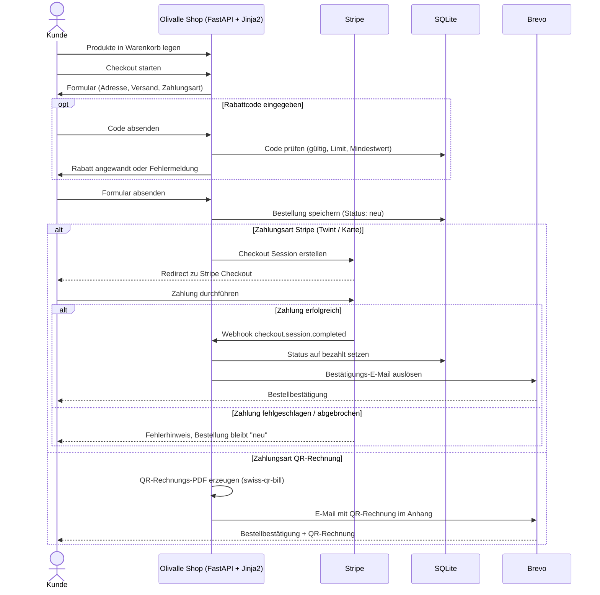

[← Übersicht](index.md)

# Olivalle — Bestellprozess

**Zweck:** Dieses Sequenzdiagramm zeigt den Ablauf einer Bestellung vom Warenkorb bis zur Bestätigung — mit beiden Zahlwegen (Stripe und QR-Rechnung), Rabattcode-Anwendung und dem Verhalten bei fehlgeschlagener Zahlung.

**Die Schritte im Einzelnen:**

- **Warenkorb & Checkout** — der Kunde wählt Produkte, gibt Adresse, Versand- und Zahlungsart an.
- **Rabattcode (optional)** — wird gegen Gültigkeit, Einlöse-Limit und Mindestbestellwert geprüft, bevor er den Total reduziert.
- **Stripe-Pfad** — bei Erfolg meldet ein Webhook die Zahlung; erst dann wird die Bestellung auf „bezahlt" gesetzt und die Bestätigung versendet. Bei Abbruch bleibt sie „neu" (Stripe wiederholt Webhooks bei Zustellfehlern automatisch).
- **QR-Rechnungs-Pfad** — für Rechnungskäufer erzeugt der Shop ein Schweizer QR-Rechnungs-PDF und versendet es als E-Mail-Anhang.
