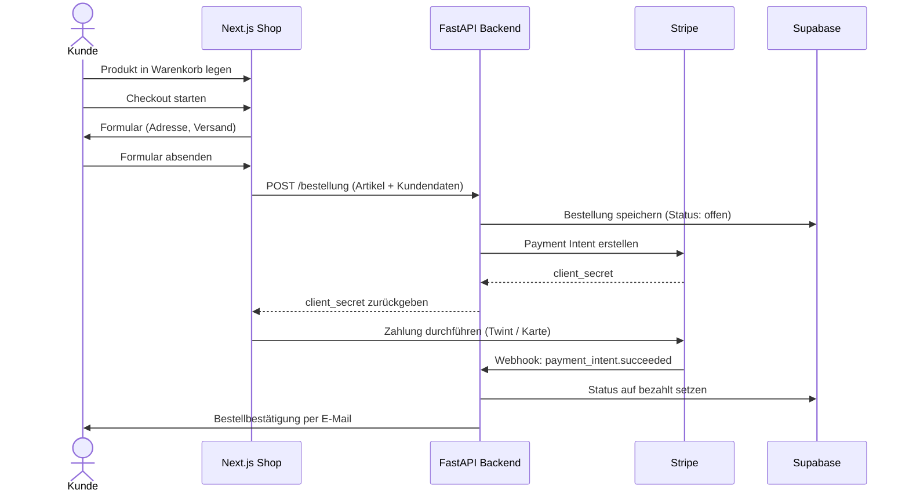

[← Übersicht](index.md)

# Olivalle — Bestellprozess

```mermaid
sequenceDiagram
    actor Kunde
    participant Shop as Next.js Shop
    participant API as FastAPI Backend
    participant Stripe
    participant DB as Supabase

    Kunde->>Shop: Produkt in Warenkorb legen
    Kunde->>Shop: Checkout starten
    Shop->>Kunde: Formular (Adresse, Versand)
    Kunde->>Shop: Formular absenden
    Shop->>API: POST /bestellung (Artikel + Kundendaten)
    API->>DB: Bestellung speichern (Status: offen)
    API->>Stripe: Payment Intent erstellen
    Stripe-->>API: client_secret
    API-->>Shop: client_secret zurückgeben
    Shop->>Stripe: Zahlung durchführen (Twint / Karte)
    Stripe->>API: Webhook: payment_intent.succeeded
    API->>DB: Status auf bezahlt setzen
    API->>Kunde: Bestellbestätigung per E-Mail
```
