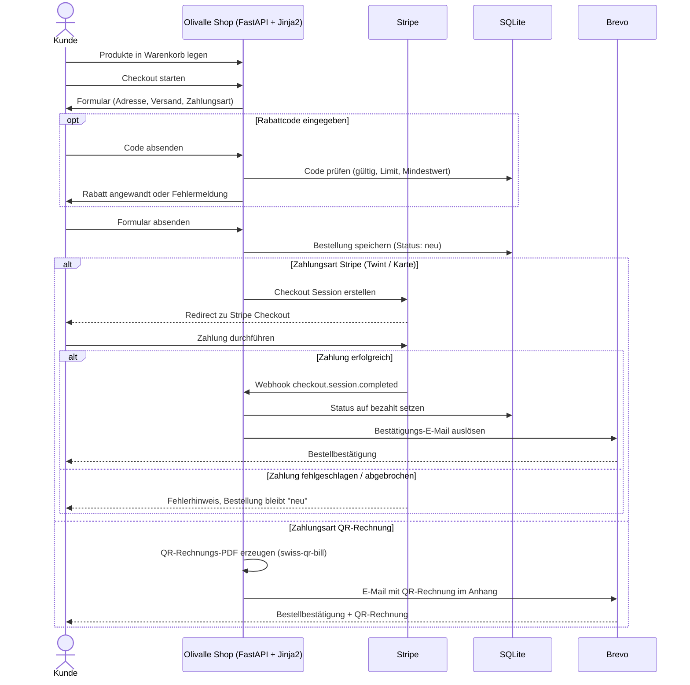
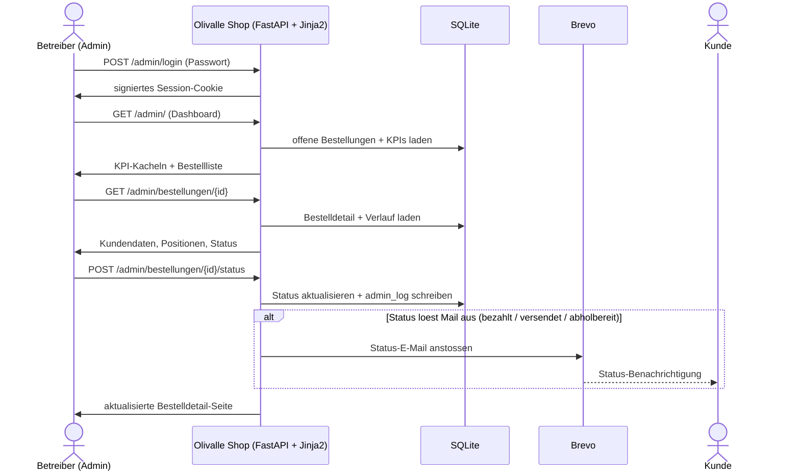

[← Übersicht](index.md)

# Olivalle — Bestellprozess

**Zweck:** Dieses Sequenzdiagramm zeigt den Ablauf einer Bestellung vom Warenkorb bis zur Bestätigung — mit beiden Zahlwegen (Stripe und QR-Rechnung), Rabattcode-Anwendung und dem Verhalten bei fehlgeschlagener Zahlung.

**Die Schritte im Einzelnen:**

- **Warenkorb & Checkout** — der Kunde wählt Produkte, gibt Adresse, Versand- und Zahlungsart an.
- **Rabattcode (optional)** — wird gegen Gültigkeit, Einlöse-Limit und Mindestbestellwert geprüft, bevor er den Total reduziert.
- **Stripe-Pfad** — bei Erfolg meldet ein Webhook die Zahlung; erst dann wird die Bestellung auf „bezahlt" gesetzt und die Bestätigung versendet. Bei Abbruch bleibt sie „neu" (Stripe wiederholt Webhooks bei Zustellfehlern automatisch).
- **QR-Rechnungs-Pfad** — für Rechnungskäufer erzeugt der Shop ein Schweizer QR-Rechnungs-PDF und versendet es als E-Mail-Anhang.

---

## Betreibersicht — eingehende Bestellung verarbeiten

**Zweck:** Spiegelbild zum Kunden-Sequenzdiagramm — der Ablauf aus Sicht des Betreibers (Stakeholder/Admin), der eine eingegangene Bestellung im Admin-Bereich bearbeitet und damit eine Status-E-Mail an den Kunden auslöst.

**Die Schritte im Einzelnen:**

- **Login** — der Betreiber meldet sich mit einem Passwort an (`POST /admin/login`); bei Erfolg gibt der Shop ein signiertes Session-Cookie aus.
- **Dashboard** — `GET /admin/` zeigt KPI-Kacheln (offene Bestellungen, Monatsumsatz, Bestellungen heute) und die filterbare Bestellliste.
- **Bestelldetail** — `GET /admin/bestellungen/{id}` öffnet Kundendaten, Positionen und den bisherigen Verlauf.
- **Statuswechsel** — `POST /admin/bestellungen/{id}/status` ändert den Status, schreibt einen Eintrag ins `admin_log` und löst — sofern der Zielstatus eine Mail vorsieht (`bezahlt`, `versendet`, `abholbereit`) — automatisch die passende Kunden-E-Mail über Brevo aus.
