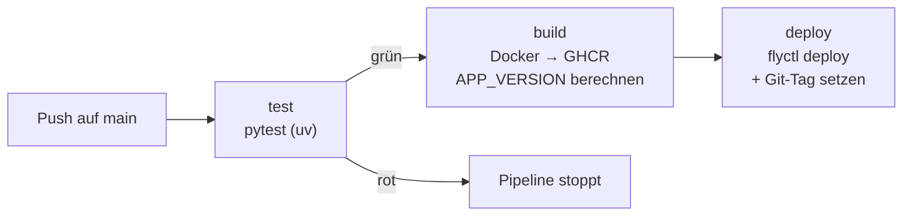

[← Übersicht](index.md)

# CI/CD & Versionierung

Wie aus einem Push auf `main` ein Deployment auf fly.io wird, wie die Versionsnummer entsteht und wie Datenbank-Migrationen ablaufen.

## Pipeline auf einen Blick

Ein Push auf `main` löst den Workflow `.github/workflows/deploy.yml` aus. Er besteht aus drei aufeinander aufbauenden Jobs:

- **`test`** — installiert Dependencies via `uv sync --extra dev` und führt `pytest` aus. Schlägt ein Test fehl, stoppt die Pipeline (`build` hat `needs: test`).
- **`build`** — baut das Docker-Image, pusht es nach GHCR (`ghcr.io/konstantinniedermann/olivalle`) und berechnet die App-Version (siehe unten). Die Version geht als Build-Arg `APP_VERSION` ins Image.
- **`deploy`** — deployt das gebaute Image mit `flyctl deploy --image …` auf fly.io, schreibt eine Job-Summary und setzt **nach erfolgreichem Deploy** den Git-Tag.

**Trigger:** `push` auf `main` sowie manuell via `workflow_dispatch`.
**Concurrency:** `group: deploy`, `cancel-in-progress: true` — bei schnell aufeinanderfolgenden Pushes wird der ältere Lauf abgebrochen, damit immer der letzte Stand deployt wird.

## Alle Workflows

| Workflow | Trigger | Aufgabe |
|---|---|---|
| `deploy.yml` | Push auf `main`, manuell | Test → Build → Deploy auf fly.io + Git-Tag |
| `lint.yml` | Pull Request + Push auf `main` | Ruff-Check + Format-Check (Qualitätsgate) |
| `docs.yml` | Push auf `main` mit Änderungen unter `docs/**` | MkDocs-Site bauen und auf GitHub Pages deployen |
| `monitor-uptime.yml` | alle 10 min (Cron), manuell | HTTP-Erreichbarkeit prüfen, Ping an Healthchecks.io |
| `monitor-tls.yml` | täglich (Cron), manuell | TLS-Zertifikat-Restlaufzeit prüfen (Alarm < 30 Tage) |
| `backup-check.yml` | täglich (Cron), manuell | Litestream-Backup-Heartbeat prüfen |

Alle `uses:`-Einträge sind auf 40-stellige Commit-SHAs gepinnt (Schutz gegen Tag-Mutation, OWASP CICD-SEC-4) und werden via Dependabot wöchentlich aktualisiert (`.github/dependabot.yml`).

## Versionierung

**Schema:** `v{MINOR}.{PATCH}` (z. B. `v1.3.7`) — adaptiert vom Munica-Projekt.

- **MINOR** steht in `pyproject.toml` (`version = "1.3"`) und wird manuell erhöht, wenn ein grösserer Funktionsblock fertig ist.
- **PATCH** berechnet die CI automatisch: Anzahl bereits existierender Git-Tags `v{MINOR}.*` + 1.
- Damit die Tag-Zählung stimmt, checkt der `build`-Job mit `fetch-depth: 0` aus (sonst sind ältere Tags nicht sichtbar).
- **Fail-safe:** Der Git-Tag wird bewusst **erst nach** erfolgreichem Deploy gesetzt. Schlägt das Deploy fehl, bleibt der PATCH-Zähler unverändert und der nächste Push verwendet dieselbe Nummer erneut.

**Sichtbarkeit der Version zur Laufzeit:** Das Build-Arg `APP_VERSION` wird im `Dockerfile` zur Umgebungsvariable, `app/config.py` liest sie als `app_version` (Default `"dev"`), und `app/templating.py` macht sie als globale Jinja2-Variable verfügbar. Der Footer (`templates/base.html`) zeigt sie an — so ist im Live-Shop jederzeit erkennbar, welcher Stand deployt ist. (Ein manueller `flyctl deploy` ohne `--build-arg APP_VERSION=…` zeigt deshalb `dev` im Footer — der CI-Deploy ist der Normalweg.)

## Releases statt CHANGELOG.md

Es gibt **bewusst keine** `CHANGELOG.md` im Repo. Die Release-Notes werden stattdessen als **GitHub Releases** kuratiert — und zwar nur bei einem MINOR-Bump (z. B. [v1.3 — Aktionspreise](https://github.com/konstantinniedermann/olivalle-webshop/releases)). Jeder Patch-Deploy erzeugt einen Git-Tag, aber kein eigenes Release; die feingranulare Historie liegt in den Git-Tags und in den geschlossenen GitHub Issues. Das hält den Pflegeaufwand für einen Ein-Personen-Betrieb gering, ohne Nachvollziehbarkeit zu verlieren.

> **Bekannte Abweichung von der ursprünglichen Spec:** Die Versioning-Spec sah für `/health` zusätzlich ein `version`-Feld vor. Implementiert ist aktuell nur `{"status": "ok"}` (mit DB-Check). Da die Version bereits im Footer und über die Git-Tags sichtbar ist, hat das `version`-Feld im Health-Check niedrige Priorität.

## Datenbank-Migrationen

SQLite kennt keinen Migrations-Service — der Mechanismus ist bewusst minimal in `app/database.py` (`init_db()`) gelöst und läuft bei **jedem** Container-Start:

1. **SQL-Dateien** unter `migrations/` werden in sortierter Reihenfolge ausgeführt (`001_initial.sql`, `002_admin.sql`, `003_rabattcodes.sql`). Die Nummerierung `NNN_*.sql` bestimmt die Reihenfolge — neue Migrationen erhalten die nächste Nummer.
2. **Idempotente Spalten-Ergänzungen** über `_add_column_if_not_exists()` — z. B. die Aktionspreis-Spalten. Dadurch ist ein erneuter Start gefahrlos: bereits existierende Spalten werden übersprungen.
3. **Produkt-Seed** in `001_initial.sql` per UPSERT (`ON CONFLICT(id) DO UPDATE`). Wichtig: Der UPSERT aktualisiert nur die Katalog-Spalten — admin-editierbare Spalten (Aktionspreise) sind ausgenommen und überleben Neustarts (siehe [arc42 §8, Bug #137](arc42.md#aktionspreise-issue-134)).

**Regel beim Schreiben neuer Migrationen:** Datei mit nächster laufender Nummer anlegen, Statements idempotent halten (`CREATE TABLE IF NOT EXISTS`, `_add_column_if_not_exists`), und keine admin-editierbaren Spalten in die Seed-UPSERT-Liste aufnehmen.

## Voraussetzungen (einmalig eingerichtet)

- GitHub-Secret `FLY_API_TOKEN` (via `fly tokens create deploy`).
- GHCR-Zugriff automatisch über `GITHUB_TOKEN` (keine zusätzliche Konfiguration).
- fly-Secrets (Stripe-, Brevo-Keys etc.) werden einmalig manuell via `fly secrets set` gesetzt — nicht über die Pipeline.
