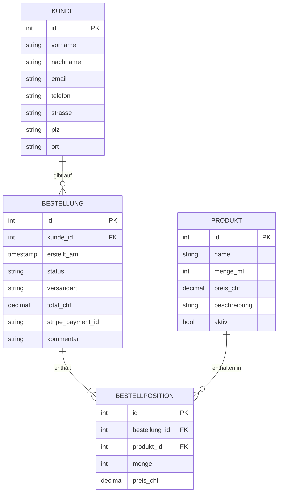

[← Übersicht](index.md)

# Olivalle — Datenbankschema

```mermaid
erDiagram
    PRODUKT {
        int id PK
        string name
        int menge_ml
        decimal preis_chf
        string beschreibung
        bool aktiv
    }

    KUNDE {
        int id PK
        string vorname
        string nachname
        string email
        string telefon
        string strasse
        string plz
        string ort
    }

    BESTELLUNG {
        int id PK
        int kunde_id FK
        timestamp erstellt_am
        string status
        string versandart
        decimal total_chf
        string stripe_payment_id
        string kommentar
    }

    BESTELLPOSITION {
        int id PK
        int bestellung_id FK
        int produkt_id FK
        int menge
        decimal preis_chf
    }

    KUNDE ||--o{ BESTELLUNG : "gibt auf"
    BESTELLUNG ||--|{ BESTELLPOSITION : "enthält"
    PRODUKT ||--o{ BESTELLPOSITION : "enthalten in"
```
