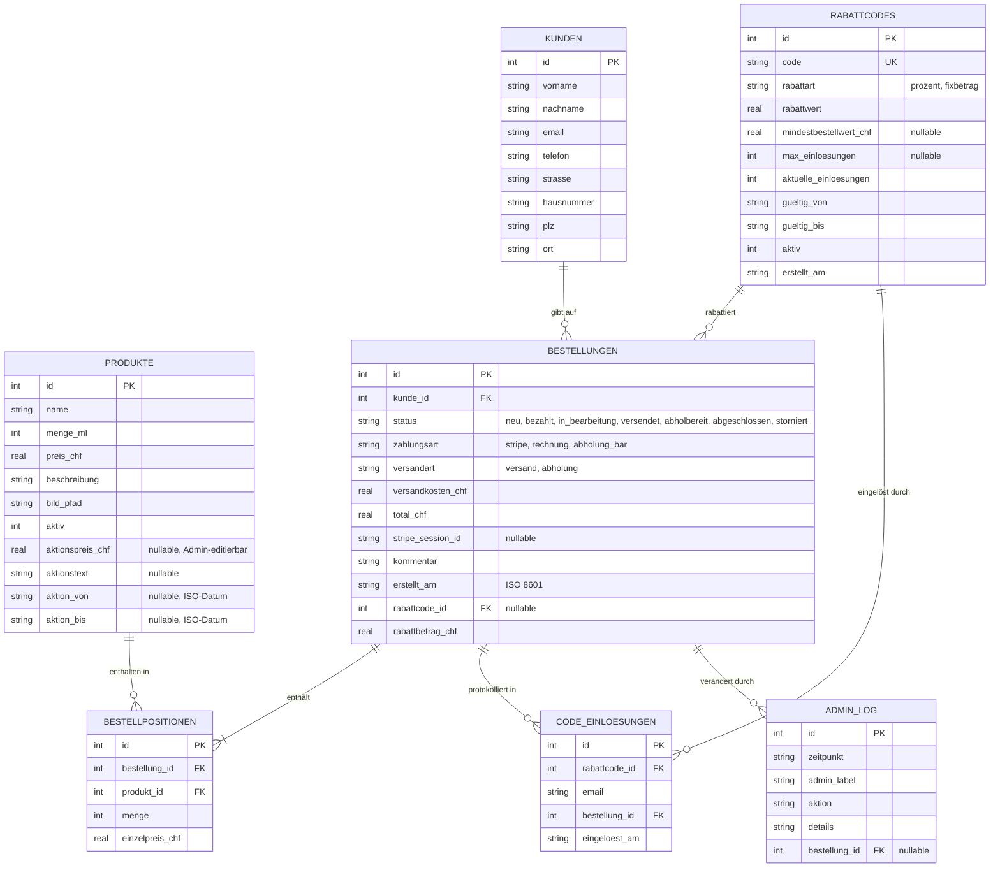

[← Übersicht](index.md)

# Olivalle — Datenbankschema

**Zweck:** Dieses Entity-Relationship-Diagramm zeigt die 7 SQLite-Tabellen des Webshops und ihre Beziehungen — vom Produktkatalog über Bestellungen bis zu Rabattcodes und Admin-Audit-Log.

> Quelle: `migrations/001_initial.sql`, `002_admin.sql`, `003_rabattcodes.sql` sowie idempotente Spalten-Ergänzungen in `app/database.py` (`init_db()`).

**Die Tabellen im Einzelnen:**

- **produkte** — Katalog. Die `aktion*`-Spalten werden im Admin gesetzt und überleben Container-Neustarts bewusst (Seed-UPSERT lässt sie unangetastet, vgl. Bug #137).
- **kunden** — Lieferadresse pro Bestellung. Pflicht: Vor-/Nachname, Strasse, PLZ, Ort, E-Mail; optional Telefon, Hausnummer.
- **bestellungen** — Kopf einer Bestellung mit Status-, Zahlungs- und Versandart sowie optional angewandtem Rabattcode.
- **bestellpositionen** — Warenkorb-Zeilen (Produkt × Menge zum Einzelpreis bei Bestellung).
- **rabattcodes** — Admin-verwaltete Codes (Prozent oder Fixbetrag), mit Gültigkeit und Einlöse-Limit.
- **code_einloesungen** — Einlöse-Protokoll; `UNIQUE(rabattcode_id, email)` verhindert Mehrfacheinlösung pro Person.
- **admin_log** — Audit-Trail aller Admin-Aktionen (DSG-relevant, siehe `datenschutz.md`).
