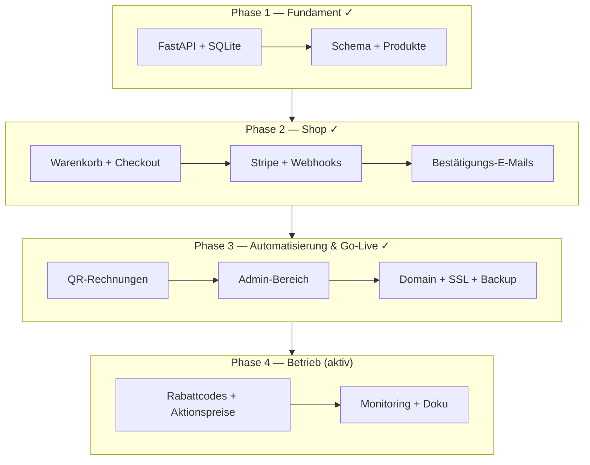

[← Übersicht](index.md)

# Olivalle — Projekt-Status & Historie

**Zweck:** Dieses Diagramm zeigt die abgeschlossenen Entwicklungsphasen (Pre-Launch) und den aktuellen Stand des Live-Betriebs.

**Stand:** Live auf [olivalle.ch](https://olivalle.ch) seit April 2026 (Version 1.4.x; die exakt deployte Version zeigen der Footer im Shop und die Git-Tags — bewusst nicht hier hartkodiert, siehe [`ci-cd-und-versionierung.md`](ci-cd-und-versionierung.md)). Phasen 0–3 abgeschlossen, Phase 4 (laufender Betrieb & Feinschliff) aktiv.

**Die Phasen im Einzelnen:**

- **Phase 1 — Fundament** — FastAPI-App, SQLite-Anbindung, Datenbankschema und Produktkatalog.
- **Phase 2 — Shop** — Warenkorb, Checkout, Stripe-Zahlung mit Webhooks, Bestätigungs-E-Mails.
- **Phase 3 — Automatisierung & Go-Live** — QR-Rechnungen, Admin-Bereich, Domain/SSL und kontinuierliches Backup.
- **Phase 4 — Betrieb (aktiv)** — Rabattcodes/Aktionspreise, Monitoring und Dokumentation.

**Ausblick:** Offene Aufgaben werden über [GitHub Issues](https://github.com/konstantinniedermann/olivalle-webshop/issues) verwaltet (Historie unter Milestones).

## Versionen & Changelog

Es gibt bewusst keine `CHANGELOG.md` (Begründung: [CI/CD & Versionierung](ci-cd-und-versionierung.md#releases-statt-changelogmd)). Die kuratierten Release-Notes liegen als [GitHub Releases](https://github.com/konstantinniedermann/olivalle-webshop/releases) vor (pro MINOR-Bump, z. B. *v1.4 — Geschenkflasche & Dokumentations-Konsolidierung*, *v1.3 — Aktionspreise*, *v1.2.1 — Backup, Monitoring & Operations-Hardening*, *v1.1.4 — Production + CI-Hardening*). Jeder Patch-Deploy erzeugt zusätzlich einen Git-Tag `v{MINOR}.{PATCH}`.

## Stakeholder-Zusammenarbeit

Das Projekt wurde nicht im stillen Kämmerlein gebaut, sondern in laufender Abstimmung mit dem Auftraggeber (Stakeholder, im Folgenden „SH") — einem Einzelunternehmer, der Olivalle betreibt. Der SH ist gleichzeitig der spätere Betreiber des Shops. Über den gesamten Projektverlauf wurden Anforderungen gemeinsam geklärt, fachliche Inhalte vom SH eingeholt und mehrere Entscheidungen durch den SH gestützt oder ausgelöst. Beispiele, die im Repo öffentlich nachvollziehbar sind:

| Thema | SH-Beitrag | Beleg |
|---|---|---|
| E-Mail-Provider | SH fragte aktiv eine Alternative mit EU-Datenstandort an → Wechsel zu Brevo | [ADR E-Mail-Provider](adr-email-provider.md) („Beteiligte: SH, KN") |
| Domain-Registrar | Deutschsprachiges Interface als SH-Anforderung in die Bewertung eingeflossen | [ADR Domain-Registrar](adr-domain-registrar.md) |
| Produktinhalte | Produkttexte, -bilder und Herkunftsangaben vom SH eingeholt | Issues [#38](https://github.com/konstantinniedermann/olivalle-webshop/issues/38), [#136](https://github.com/konstantinniedermann/olivalle-webshop/issues/136) |
| Abholung / Versand | Abholadresse und Versandlogik mit SH abgestimmt; „Bezahlung bei Abholung" als gewünschte Option | Issues [#37](https://github.com/konstantinniedermann/olivalle-webshop/issues/37), [#59](https://github.com/konstantinniedermann/olivalle-webshop/issues/59) |
| Go-Live-Freigabe | Smoke-Tests gemeinsam mit SH, formale Freigabe vor Launch | Issue [#67](https://github.com/konstantinniedermann/olivalle-webshop/issues/67) |
| Produktseite / Texte | Textüberarbeitung und Lebensmittel-Deklaration auf Wunsch / mit SH | Issues [#102](https://github.com/konstantinniedermann/olivalle-webshop/issues/102), [#100](https://github.com/konstantinniedermann/olivalle-webshop/issues/100) |
| Rechtliches | Datenschutzerklärung (revDSG-konform) abgestimmt | Issue [#69](https://github.com/konstantinniedermann/olivalle-webshop/issues/69) |

Architektur- und Tech-Entscheidungen sind zusätzlich in den [ADRs](adr-index.md) festgehalten — dort ist jeweils vermerkt, wer beteiligt war.
