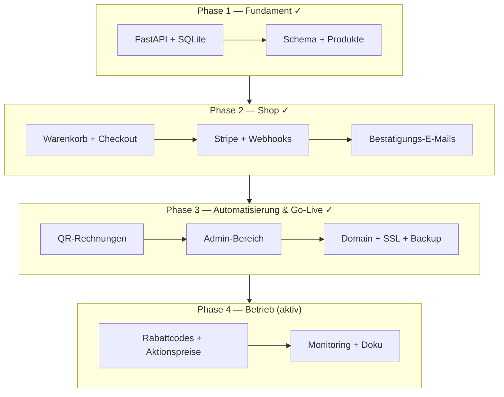

[← Übersicht](index.md)

# Olivalle — Projekt-Status & Historie

**Zweck:** Dieses Diagramm zeigt die abgeschlossenen Entwicklungsphasen (Pre-Launch) und den aktuellen Stand des Live-Betriebs.

**Stand:** Live auf [olivalle.ch](https://olivalle.ch) seit April 2026, aktuell v1.3.5. Phasen 0–3 abgeschlossen, Phase 4 (laufender Betrieb & Feinschliff) aktiv.

**Die Phasen im Einzelnen:**

- **Phase 1 — Fundament** — FastAPI-App, SQLite-Anbindung, Datenbankschema und Produktkatalog.
- **Phase 2 — Shop** — Warenkorb, Checkout, Stripe-Zahlung mit Webhooks, Bestätigungs-E-Mails.
- **Phase 3 — Automatisierung & Go-Live** — QR-Rechnungen, Admin-Bereich, Domain/SSL und kontinuierliches Backup.
- **Phase 4 — Betrieb (aktiv)** — Rabattcodes/Aktionspreise, Monitoring und Dokumentation.

**Ausblick:** Offene Aufgaben werden über [GitHub Issues](https://github.com/konstantinniedermann/olivalle-webshop/issues) verwaltet (Historie unter Milestones).
