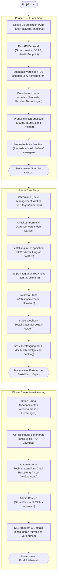

[← Übersicht](index.md)

# Olivalle — Roadmap

```mermaid
graph TD
    START(["Projektstart"]) --> P1

    subgraph P1["Phase 1 — Fundament"]
        direction TB
        p1a["Next.js 15 aufsetzen (App Router, Tailwind, shadcn/ui)"]
        p1b["FastAPI Backend (Grundstruktur, CORS, Health-Endpoint)"]
        p1c["Supabase verbinden (DB anlegen, .env konfigurieren)"]
        p1d["Datenbankschema erstellen (Produkte, Kunden, Bestellungen)"]
        p1e["Produkte in DB erfassen (250ml, 750ml, 3l mit Preisen)"]
        p1f["Produktseite im Frontend (Produkte aus API laden & anzeigen)"]
        M1{{"Meilenstein: Shop ist sichtbar"}}

        p1a --> p1b --> p1c --> p1d --> p1e --> p1f --> M1
    end

    subgraph P2["Phase 2 — Shop"]
        direction TB
        p2a["Warenkorb (State Management, Artikel hinzufügen/entfernen)"]
        p2b["Checkout-Formular (Adresse, Versandart wählen)"]
        p2c["Bestellung in DB speichern (POST /bestellung via FastAPI)"]
        p2d["Stripe Integration (Payment Intent, Kreditkarte)"]
        p2e["Twint via Stripe (Zahlungsmethode aktivieren)"]
        p2f["Stripe Webhook (Bestellstatus auf bezahlt setzen)"]
        p2g["Bestellbestätigung per E-Mail (nach erfolgreicher Zahlung)"]
        M2{{"Meilenstein: Erste echte Bestellung möglich"}}

        p2a --> p2b --> p2c --> p2d --> p2e --> p2f --> p2g --> M2
    end

    subgraph P3["Phase 3 — Automatisierung"]
        direction TB
        p3a["Stripe Billing (Abonnements / wiederkehrende Lieferungen)"]
        p3b["QR-Rechnung generieren (swiss-qr-bill, PDF-Download)"]
        p3c["Automatisierte Rechnungsstellung (nach Bestellung & Abo-Verlängerung)"]
        p3d["Admin-Bereich (Bestellübersicht, Status verwalten)"]
        p3e["SSL erneuern & Domain konfigurieren (olivalle.ch, vor Launch)"]
        M3{{"Meilenstein: Produktivbetrieb"}}

        p3a --> p3b --> p3c --> p3d --> p3e --> M3
    end

    M1 --> P2
    M2 --> P3
```
