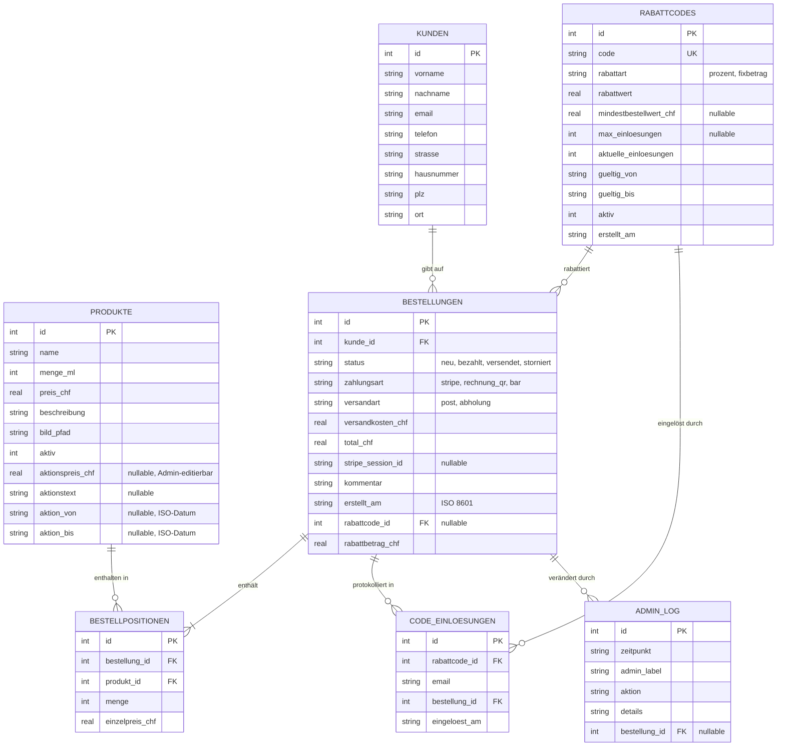
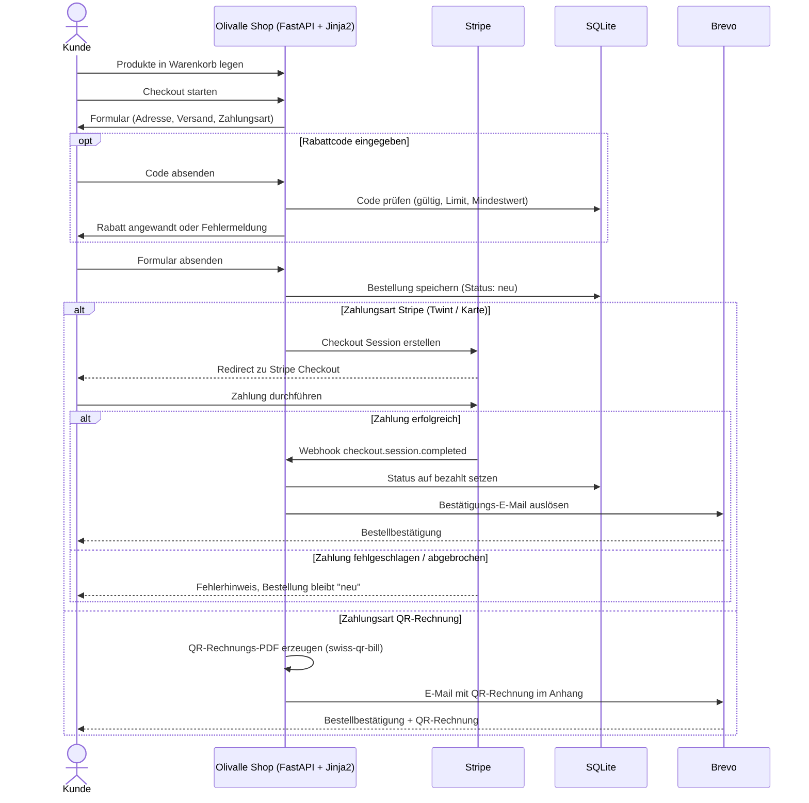
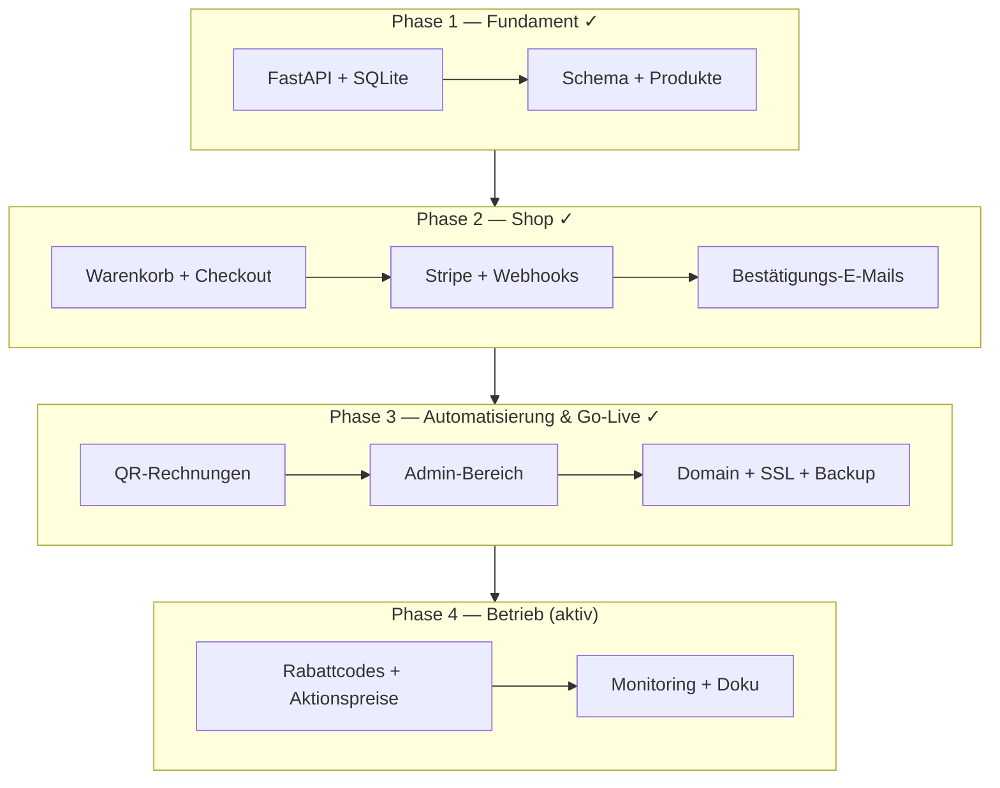

# Doku-Konsolidierung Olivalle (CAS-Abgabe) — Implementation Plan

> **For agentic workers:** REQUIRED SUB-SKILL: Use superpowers:subagent-driven-development (recommended) or superpowers:executing-plans to implement this plan task-by-task. Steps use checkbox (`- [ ]`) syntax for tracking.

**Goal:** Die Projektdokumentation auf einen einheitlichen, für Dritte (CAS-Bewerter) nachvollziehbaren Stand bringen und als GitHub-Pages-Site veröffentlichen.

**Architecture:** Reine Doku-/Config-Arbeit, kein Applikationscode. `docs/index.md` wird der erzählte Einstieg (roter Faden Problem→Lösung→Architektur→Validierung→Betrieb) und einzige kanonische Doku-Übersicht; `mkdocs.yml` nav und README werden darauf synchronisiert. Eine GitHub Action baut die MkDocs-Site und deployed sie auf GitHub Pages.

**Tech Stack:** MkDocs 1.6 + mkdocs-material + mkdocs-mermaid2-plugin (bereits im `docs`-Extra von `pyproject.toml`), GitHub Actions, GitHub Pages.

## Global Constraints

- UI-/Doku-Texte auf Deutsch (CH). Verbatim aus Projektregeln.
- Keine `\n` in Mermaid-Node-Labels (wird in VS Code als Literal gerendert).
- Jedes Mermaid-Diagramm braucht: (1) Zweck-Satz davor, (2) Element-Erklärung danach.
- Neue/geänderte `uses:`-Zeilen in GitHub-Workflows auf 40-stellige SHAs pinnen, mit `# vX.Y.Z`-Kommentar.
- Commit-Präfixe: `docs:`, `feat:`, `fix:`, `refactor:`, `test:`.
- Commit-Footer: `Co-Authored-By: Claude Opus 4.8 (1M context) <noreply@anthropic.com>`.
- Branch: `docs/konsolidierung-cas-abgabe` (bereits angelegt). Merge via PR.
- Scope-Guard: keine App-Code-Änderungen, keine weiteren ADRs als die Tech-Stack-ADR, kein CHANGELOG, kein Security-Vollaudit.
- Verifikation für Doku-Arbeit ersetzt TDD: `uv run mkdocs build --strict` muss fehlerfrei sein (fängt fehlende nav-Ziele + tote interne Links).

### Verifiziertes DB-Schema (Quelle: migrations/*.sql + app/database.py)

7 Tabellen. Per Python in `init_db()` ergänzte Spalten sind markiert (⁺):

- **produkte**: id PK, name, menge_ml, preis_chf, beschreibung, bild_pfad, aktiv, aktionspreis_chf⁺, aktionstext⁺, aktion_von⁺, aktion_bis⁺
- **kunden**: id PK, vorname, nachname, email, telefon, strasse, plz, ort, hausnummer⁺
- **bestellungen**: id PK, kunde_id FK, status, zahlungsart, versandart, versandkosten_chf, total_chf, stripe_session_id, kommentar, erstellt_am, rabattcode_id⁺ FK, rabattbetrag_chf⁺
- **bestellpositionen**: id PK, bestellung_id FK, produkt_id FK, menge, einzelpreis_chf
- **admin_log**: id PK, zeitpunkt, admin_label, aktion, details, bestellung_id FK
- **rabattcodes**: id PK, code (UNIQUE), rabattart (prozent|fixbetrag), rabattwert, mindestbestellwert_chf, max_einloesungen, aktuelle_einloesungen, gueltig_von, gueltig_bis, aktiv, erstellt_am
- **code_einloesungen**: id PK, rabattcode_id FK, email, bestellung_id FK, eingeloest_am, UNIQUE(rabattcode_id, email)

### Produkte (Quelle: migrations/001_initial.sql Seed)

- Olivenöl 250ml — CHF 8
- Olivenöl 750ml — CHF 18
- Olivenöl 3l Kanister — CHF 50
- Olivenöl 500ml (Geschenkflasche „Olivar de los 3 Ríos") — CHF 25

---

### Task 1: Datenbankschema auf 7 Tabellen korrigieren

**Files:**
- Modify: `docs/datenbankschema.md` (komplett ersetzen)

**Interfaces:**
- Produces: korrektes ER-Diagramm, auf das `arc42.md` und `index.md` verweisen.

- [ ] **Step 1: Datei ersetzen** mit folgendem Inhalt:

````markdown
[← Übersicht](index.md)

# Olivalle — Datenbankschema

**Zweck:** Dieses Entity-Relationship-Diagramm zeigt die 7 SQLite-Tabellen des Webshops und ihre Beziehungen — vom Produktkatalog über Bestellungen bis zu Rabattcodes und Admin-Audit-Log.

> Quelle: `migrations/001_initial.sql`, `002_admin.sql`, `003_rabattcodes.sql` sowie idempotente Spalten-Ergänzungen in `app/database.py` (`init_db()`).



**Die Tabellen im Einzelnen:**

- **produkte** — Katalog. Die `aktion*`-Spalten werden im Admin gesetzt und überleben Container-Neustarts bewusst (Seed-UPSERT lässt sie unangetastet, vgl. Bug #137).
- **kunden** — Lieferadresse pro Bestellung. Pflicht: Vor-/Nachname, Strasse, PLZ, Ort, E-Mail; optional Telefon, Hausnummer.
- **bestellungen** — Kopf einer Bestellung mit Status-, Zahlungs- und Versandart sowie optional angewandtem Rabattcode.
- **bestellpositionen** — Warenkorb-Zeilen (Produkt × Menge zum Einzelpreis bei Bestellung).
- **rabattcodes** — Admin-verwaltete Codes (Prozent oder Fixbetrag), mit Gültigkeit und Einlöse-Limit.
- **code_einloesungen** — Einlöse-Protokoll; `UNIQUE(rabattcode_id, email)` verhindert Mehrfacheinlösung pro Person.
- **admin_log** — Audit-Trail aller Admin-Aktionen (DSG-relevant, siehe `datenschutz.md`).
````

- [ ] **Step 2: Mermaid-Diagramm validieren** — Build-Check kommt gesammelt in Task 11. Hier nur Sichtprüfung: keine `\n` in Labels, alle 7 Tabellen vorhanden.

- [ ] **Step 3: Commit**

```bash
git add docs/datenbankschema.md
git commit -m "docs: Datenbankschema auf 7 Tabellen + Aktions-/Rabatt-Spalten korrigieren

Co-Authored-By: Claude Opus 4.8 (1M context) <noreply@anthropic.com>"
```

---

### Task 2: Systemarchitektur — Backup-Pfad + Prosa ergänzen

**Files:**
- Modify: `docs/systemarchitektur.md` (komplett ersetzen)

- [ ] **Step 1: Datei ersetzen** mit folgendem Inhalt:

````markdown
[← Übersicht](index.md)

# Olivalle — Systemarchitektur

**Zweck:** Dieses Diagramm zeigt, wie die Komponenten der Olivalle-Anwendung und die externen Dienste (Stripe, Brevo, Tigris) zusammenspielen — inklusive des kontinuierlichen Backup-Pfads.

```mermaid
graph TD
    subgraph flyio["fly.io (1 Docker-Container, Region cdg)"]
        API["FastAPI"]
        Templates["Jinja2-Templates + Tailwind CSS"]
        DB["SQLite (Volume /data)"]
        QR["swiss-qr-bill"]
        LS["Litestream"]
    end

    Browser["Browser"] -->|HTTP/HTTPS| API
    API --> Templates
    API --> DB
    API -->|Checkout Session| Stripe
    Stripe -->|Webhook| API
    API -->|Bestellbestätigung| Brevo["Brevo (E-Mail)"]
    API -->|PDF generieren| QR
    DB -->|kontinuierliche Replikation| LS
    LS -->|Backup| Tigris["Tigris-Bucket (EU: AMS + FRA)"]
    Brevo -->|bestellung@olivalle.ch| Kunde["Kunde (E-Mail)"]
```

**Die Elemente im Einzelnen:**

- **FastAPI** — der Anwendungskern; bedient Shop-Seiten, Checkout, Admin und Stripe-Webhooks.
- **Jinja2 + Tailwind CSS** — server-seitig gerendertes HTML (kein separates Frontend-Framework).
- **SQLite** — eingebettete Datenbank auf dem persistenten fly.io-Volume `/data`.
- **swiss-qr-bill** — erzeugt Schweizer QR-Rechnungs-PDFs für Rechnungskäufer.
- **Litestream → Tigris** — repliziert die SQLite-DB kontinuierlich in einen EU-Bucket (Amsterdam + Frankfurt); beim Volume-Verlust restored der Container automatisch beim Start (siehe `adr-backup-strategie.md`, `runbook-restore.md`).
- **Stripe** — Zahlungsabwicklung (TWINT, Kreditkarte); meldet erfolgreiche Zahlung per Webhook zurück.
- **Brevo** — versendet Bestätigungs-E-Mails von `bestellung@olivalle.ch` (Absender via fly-Secret konfiguriert).
````

- [ ] **Step 2: Sichtprüfung** — keine `\n` in Labels, Backup-Pfad (DB→LS→Tigris) enthalten.

- [ ] **Step 3: Commit**

```bash
git add docs/systemarchitektur.md
git commit -m "docs: Systemarchitektur um Backup-Pfad + Element-Erklärung ergänzen

Co-Authored-By: Claude Opus 4.8 (1M context) <noreply@anthropic.com>"
```

---

### Task 3: Bestellprozess — QR/Rabatt/Fehlerpfad ergänzen

**Files:**
- Modify: `docs/bestellprozess.md` (komplett ersetzen)

- [ ] **Step 1: Datei ersetzen** mit folgendem Inhalt:

````markdown
[← Übersicht](index.md)

# Olivalle — Bestellprozess

**Zweck:** Dieses Sequenzdiagramm zeigt den Ablauf einer Bestellung vom Warenkorb bis zur Bestätigung — mit beiden Zahlwegen (Stripe und QR-Rechnung), Rabattcode-Anwendung und dem Verhalten bei fehlgeschlagener Zahlung.



**Die Schritte im Einzelnen:**

- **Warenkorb & Checkout** — der Kunde wählt Produkte, gibt Adresse, Versand- und Zahlungsart an.
- **Rabattcode (optional)** — wird gegen Gültigkeit, Einlöse-Limit und Mindestbestellwert geprüft, bevor er den Total reduziert.
- **Stripe-Pfad** — bei Erfolg meldet ein Webhook die Zahlung; erst dann wird die Bestellung auf „bezahlt" gesetzt und die Bestätigung versendet. Bei Abbruch bleibt sie „neu" (Stripe wiederholt Webhooks bei Zustellfehlern automatisch).
- **QR-Rechnungs-Pfad** — für Rechnungskäufer erzeugt der Shop ein Schweizer QR-Rechnungs-PDF und versendet es als E-Mail-Anhang.
````

- [ ] **Step 2: Sichtprüfung** — beide alt/else-Pfade vorhanden, keine `\n` in Labels.

- [ ] **Step 3: Commit**

```bash
git add docs/bestellprozess.md
git commit -m "docs: Bestellprozess um QR-Rechnung, Rabatt und Fehlerpfad ergänzen

Co-Authored-By: Claude Opus 4.8 (1M context) <noreply@anthropic.com>"
```

---

### Task 4: Tech-Stack-ADR + ADR-Index erstellen

**Files:**
- Create: `docs/adr-tech-stack.md`
- Create: `docs/adr-index.md`

**Interfaces:**
- Produces: `adr-tech-stack.md` (referenziert von `arc42.md`, Task 7) und `adr-index.md` (in nav, Task 10).

- [ ] **Step 1: `docs/adr-tech-stack.md` erstellen** mit folgendem Inhalt:

````markdown
[← Übersicht](index.md)

# ADR: Tech-Stack-Wahl

**Status:** Entschieden · **Datum:** 2026-04 (rückwirkend dokumentiert) · **Bezug:** arc42 §4 Lösungsstrategie

## Kontext

Olivalle ersetzt einen manuellen Bestellprozess (Tally-Formular + manuelle Rechnung) durch einen Webshop für einen Schweizer Einzelunternehmer mit ~100 Bestellungen/Monat. Der Entwickler ist Python-/SQL-erfahren, in JavaScript/React aber Anfänger. Wartbarkeit durch eine Einzelperson, tiefe Betriebskosten und Schweizer Rechtskonformität (MWST, DSG) sind ausschlaggebend.

## Entscheidung

| Bereich | Wahl | Kernbegründung |
|---|---|---|
| Sprache/Framework | Python + FastAPI | Entwickler kennt Python; FastAPI ist schlank, typsicher, gut dokumentiert |
| UI | Jinja2-Templates + Tailwind CSS (server-rendered) | Kein zweites Framework/Sprachkontext; alles in Python |
| Datenbank | SQLite (Datei auf fly.io-Volume) | Eine Datei, kein DB-Service; reicht für ~100 Bestellungen/Mt |
| Payments | Stripe | TWINT (CH) + Kreditkarte nativ; etablierte Webhook-Integration |
| QR-Rechnung | swiss-qr-bill (`qrbill`) | Open Source, direkt im Code, kein Bexio-Abo |
| Hosting | fly.io (1 Docker-Container) | Günstig (~$2/Mt real), kommerziell erlaubt, einfaches Deploy |
| E-Mail | Brevo | EU/DSG-konform, Free Tier deckt das Volumen (siehe `adr-email-provider.md`) |

## Verworfene Alternativen

- **React/Next.js-SPA** — verworfen: zweiter Sprach-/Build-Kontext, für einen Anfänger und einen simplen Shop unnötige Komplexität (KISS/YAGNI). Server-rendered HTML genügt.
- **PostgreSQL** — verworfen: eigener Service + Betrieb/Backup-Aufwand, der bei diesem Volumen keinen Nutzen bringt. SQLite + Litestream-Replikation deckt Persistenz und Backup ab.
- **Bexio/SaaS-Rechnung** — verworfen: laufende Kosten; QR-Rechnung lässt sich Open Source direkt erzeugen.
- **PaaS wie Heroku/Render** — verworfen zugunsten fly.io wegen Preis und Docker-Kontrolle.

## Konsequenzen

- **Positiv:** Ein einziger Sprach-/Tooling-Kontext (Python); minimale Fixkosten; geringe Betriebslast für eine Einzelperson; volle Kontrolle über QR-Rechnung und Daten.
- **Negativ / Grenzen:** SQLite skaliert nicht für hohe Parallel-Schreiblast (für dieses Volumen irrelevant); server-rendered UI bietet weniger clientseitige Interaktivität — bewusst akzeptiert.
- **Folge-ADRs:** Domain-Registrar, E-Mail-Provider und Backup-Strategie sind separat dokumentiert (siehe ADR-Index).
````

- [ ] **Step 2: `docs/adr-index.md` erstellen** mit folgendem Inhalt:

````markdown
[← Übersicht](index.md)

# Architektur-Entscheidungen (ADRs)

Architecture Decision Records halten Entscheidungen mit Tragweite fest — *warum* etwas so gebaut wurde, nicht nur *wie*.

| ADR | Titel | Status | Datum |
|---|---|---|---|
| [Tech-Stack](adr-tech-stack.md) | Sprache, UI, DB, Payments, Hosting | Entschieden | 2026-04 |
| [Backup-Strategie](adr-backup-strategie.md) | Litestream + Tigris statt Snapshots | Entschieden | 2026-04-22 |
| [Domain-Registrar](adr-domain-registrar.md) | Infomaniak für olivalle.ch | Entschieden | 2026-03-30 |
| [E-Mail-Provider](adr-email-provider.md) | Brevo (EU/DSG, Free Tier) | Entschieden | 2026-04-01 |
````

- [ ] **Step 3: Commit**

```bash
git add docs/adr-tech-stack.md docs/adr-index.md
git commit -m "docs: konsolidierte Tech-Stack-ADR + ADR-Index ergänzen

Co-Authored-By: Claude Opus 4.8 (1M context) <noreply@anthropic.com>"
```

---

### Task 5: roadmap.md → projekt-status.md umbauen

**Files:**
- Create: `docs/projekt-status.md` (Inhalt unten)
- Delete: `docs/roadmap.md`

**Interfaces:**
- Consumes: ersetzt alle bisherigen Verweise auf `roadmap.md` (in `index.md` Task 6, `mkdocs.yml` Task 10).

- [ ] **Step 1: `git mv` zur Historie-Erhaltung**

```bash
git mv docs/roadmap.md docs/projekt-status.md
```

- [ ] **Step 2: `docs/projekt-status.md` ersetzen** mit folgendem Inhalt:

````markdown
[← Übersicht](index.md)

# Olivalle — Projekt-Status & Historie

**Zweck:** Dieses Diagramm zeigt die abgeschlossenen Entwicklungsphasen (Pre-Launch) und den aktuellen Stand des Live-Betriebs.

**Stand:** Live auf [olivalle.ch](https://olivalle.ch) seit April 2026, aktuell v1.3.5. Phasen 0–3 abgeschlossen, Phase 4 (laufender Betrieb & Feinschliff) aktiv.



**Ausblick:** Offene Aufgaben werden über [GitHub Issues](https://github.com/konstantinniedermann/olivalle-webshop/issues) verwaltet (Historie unter Milestones).
````

- [ ] **Step 3: Commit**

```bash
git add docs/projekt-status.md
git commit -m "docs: roadmap zu Projekt-Status & Historie umbauen (Phasen abgeschlossen)

Co-Authored-By: Claude Opus 4.8 (1M context) <noreply@anthropic.com>"
```

---

### Task 6: index.md zum Narrativ-Einstieg umbauen

**Files:**
- Modify: `docs/index.md` (komplett ersetzen)

**Interfaces:**
- Consumes: alle Doku-Dateien (verlinkt sie in Lesereihenfolge); muss mit `mkdocs.yml` nav (Task 10) übereinstimmen.

- [ ] **Step 1: Datei ersetzen** mit folgendem Inhalt:

````markdown
# Olivalle — Projektdokumentation

Webshop für biologisches Olivenöl aus Andalusien, live auf [olivalle.ch](https://olivalle.ch). Diese Dokumentation führt von der Problemstellung über die Lösung und Architektur bis zu Validierung und Betrieb.

## Das Projekt in einem Satz

Olivalle ersetzt einen manuellen Bestellprozess (Tally-Formular + manuelle Rechnungen) durch einen vollständigen Webshop mit Kartenzahlung/TWINT, automatischer Bestellbestätigung und Schweizer QR-Rechnung — gebaut für einen Einzelunternehmer im Rahmen des CAS AI-Supported Software Engineering (FFHS).

## So liest du diese Doku (roter Faden)

1. **Problem & Ziele** → [arc42 §1](arc42.md) — was sollte gelöst werden, für wen.
2. **Lösung & Architektur** → [arc42](arc42.md) (Gesamtbild), [Systemarchitektur](systemarchitektur.md) (Komponenten), [Datenbankschema](datenbankschema.md) (Daten), [Bestellprozess](bestellprozess.md) (Ablauf).
3. **Entscheidungen** → [ADR-Index](adr-index.md) — warum dieser Tech-Stack, dieses Backup, diese Anbieter.
4. **Validierung** → [User Stories & Testplan](user-stories-testplan.md), [Security-Referenz](security.md).
5. **Betrieb** → [Restore-Runbook](runbook-restore.md), [Incident-Runbook](runbook-incident.md), [Datenschutz (intern)](datenschutz.md).

## Alle Dokumente

| Bereich | Dokument |
|---|---|
| **Architektur** | [arc42](arc42.md) · [Systemarchitektur](systemarchitektur.md) · [Datenbankschema](datenbankschema.md) · [Bestellprozess](bestellprozess.md) |
| **Entscheidungen** | [ADR-Index](adr-index.md) · [Tech-Stack](adr-tech-stack.md) · [Backup-Strategie](adr-backup-strategie.md) · [Domain-Registrar](adr-domain-registrar.md) · [E-Mail-Provider](adr-email-provider.md) |
| **Validierung** | [User Stories & Testplan](user-stories-testplan.md) · [Security](security.md) |
| **Betrieb** | [Restore-Runbook](runbook-restore.md) · [Incident-Runbook](runbook-incident.md) · [Datenschutz (intern)](datenschutz.md) |
| **Rechtliches** | [AGB](legal/agb.md) · [Datenschutzerklärung](legal/datenschutz.md) · [Impressum](legal/impressum.md) |
| **Projekt** | [Status & Historie](projekt-status.md) |

> Historische Artefakte (Setup-Anleitungen, Go-Live-Protokolle, Implementierungspläne) liegen unter `docs/archiv/`.
````

- [ ] **Step 2: Commit**

```bash
git add docs/index.md
git commit -m "docs: index.md zum erzählten Einstieg mit rotem Faden umbauen

Co-Authored-By: Claude Opus 4.8 (1M context) <noreply@anthropic.com>"
```

---

### Task 7: arc42.md auf ADR + Stand abgleichen

**Files:**
- Modify: `docs/arc42.md` (gezielte Edits)

- [ ] **Step 1: Produkttabelle prüfen** — sicherstellen, dass alle 4 Produkte korrekt gelistet sind (250ml/8, 500ml Geschenkflasche/25, 750ml/18, 3l/50). Falsche/fehlende Zeilen korrigieren.

- [ ] **Step 2: Entscheidungs-Abschnitt entschlacken** — Wo arc42 die Tech-Stack-Wahl inline erzählt, einen Verweis ergänzen: „Die konsolidierte Begründung steht in der [Tech-Stack-ADR](adr-tech-stack.md)." Inline-Erzählung auf das Nötige kürzen, keine Doppelpflege.

- [ ] **Step 3: Stand-/Versionsangaben prüfen** — falls eine konkrete Version oder ein „Stand"-Datum genannt ist, auf v1.3.5 / 2026-06 aktualisieren. GitHub-Issue-Referenzen (#134, #137 etc.) belassen, aber wo als offener Punkt formuliert: als erledigt kennzeichnen.

- [ ] **Step 4: Interne Links prüfen** — alle `](*.md)`-Verweise in arc42 zeigen auf existierende Dateien (insb. `systemarchitektur.md`, `datenbankschema.md`, `bestellprozess.md`, neu `adr-tech-stack.md`).

- [ ] **Step 5: Commit**

```bash
git add docs/arc42.md
git commit -m "docs: arc42 auf Tech-Stack-ADR verweisen + Stand aktualisieren

Co-Authored-By: Claude Opus 4.8 (1M context) <noreply@anthropic.com>"
```

---

### Task 8: security.md schärfen

**Files:**
- Modify: `docs/security.md` (erweitern)

- [ ] **Step 1: Bestehende Schutzmaßnahmen faktisch ergänzen.** Die Datei behält die XSS-Audit-Notiz und ergänzt eine knappe, faktische Liste der im Code vorhandenen Maßnahmen (verifizierbar in `app/`):

````markdown
## Vorhandene Schutzmaßnahmen

- **CSRF-Schutz:** Token-basiert für alle Formulare (`app/csrf.py`).
- **Rate-Limiting:** In-memory Sliding-Window auf `/bestellen` und Admin-Login (`app/services/rate_limit.py`).
- **Security-Header:** gesetzt via Middleware (`app/middleware/security_headers.py`).
- **Admin-Auth:** bcrypt-gehashtes Passwort, kein Klartext im Code (`app/services/auth_service.py`).
- **Secrets:** ausschließlich via Umgebungsvariablen / `fly secrets`, nichts im Repo (`.env` gitignored).
- **XSS:** Jinja2-Autoescaping aktiv; kein ungeprüftes `|safe`/`Markup()` (Audit 2026-04-07).
````

(Pfade vor dem Schreiben gegen `app/` verifizieren; nur real existierende Dateien nennen. Kein Vollaudit — nur Bestandsaufnahme.)

- [ ] **Step 2: Commit**

```bash
git add docs/security.md
git commit -m "docs: Security-Referenz um vorhandene Schutzmaßnahmen ergänzen

Co-Authored-By: Claude Opus 4.8 (1M context) <noreply@anthropic.com>"
```

---

### Task 9: README-Doku-Tabelle eindampfen + Doku-Site-Verweis

**Files:**
- Modify: `README.md` (Abschnitt „Dokumentation", Zeilen ~100–114)

**Interfaces:**
- Consumes: Doku-Site-URL `https://konstantinniedermann.github.io/olivalle-webshop/` (deterministisch aus User/Repo; Pages wird in Task 12 aktiviert).

- [ ] **Step 1: Den Abschnitt „## Dokumentation" ersetzen** durch:

````markdown
## Dokumentation

Die vollständige, navigierbare Projektdokumentation liegt als Doku-Site vor:

➡️ **[olivalle-Doku (GitHub Pages)](https://konstantinniedermann.github.io/olivalle-webshop/)**

Quelle der Doku: [`docs/`](docs/) — Einstieg über [`docs/index.md`](docs/index.md) (roter Faden: Problem → Lösung → Architektur → Validierung → Betrieb). Architektur nach **arc42**, Entscheidungen als **ADRs**, Diagramme als **Mermaid**.
````

- [ ] **Step 2: Commit**

```bash
git add README.md
git commit -m "docs: README-Doku-Abschnitt auf Doku-Site-Verweis eindampfen

Co-Authored-By: Claude Opus 4.8 (1M context) <noreply@anthropic.com>"
```

---

### Task 10: mkdocs.yml nav synchronisieren

**Files:**
- Modify: `mkdocs.yml` (nav-Block)

**Interfaces:**
- Consumes: muss exakt die Dateien aus `docs/index.md` (Task 6) abbilden.

- [ ] **Step 1: nav-Block ersetzen** durch:

````yaml
nav:
  - Übersicht: index.md
  - Architektur:
    - arc42: arc42.md
    - Systemarchitektur: systemarchitektur.md
    - Datenbankschema: datenbankschema.md
    - Bestellprozess: bestellprozess.md
  - Entscheidungen (ADRs):
    - Übersicht: adr-index.md
    - Tech-Stack: adr-tech-stack.md
    - Backup-Strategie: adr-backup-strategie.md
    - Domain-Registrar: adr-domain-registrar.md
    - E-Mail-Provider: adr-email-provider.md
  - Validierung:
    - User Stories & Testplan: user-stories-testplan.md
    - Security: security.md
  - Betrieb:
    - Restore-Runbook: runbook-restore.md
    - Incident-Runbook: runbook-incident.md
    - Datenschutz (intern): datenschutz.md
  - Rechtliches:
    - AGB: legal/agb.md
    - Datenschutz: legal/datenschutz.md
    - Impressum: legal/impressum.md
  - Projekt:
    - Status & Historie: projekt-status.md
  - Archiv:
    - Stripe-Setup-Anleitung: archiv/anleitung-stripe-setup.md
    - E-Mail-Provider Evaluation: archiv/email-provider-evaluation.md
    - Go-Live Smoke-Tests: archiv/go-live-smoke-tests.md
    - Produkttexte: archiv/produkttexte.md
    - Manuelles Testprotokoll: archiv/testprotokoll.md
````

(Korrigiert: toter `produkttexte.md` → `archiv/produkttexte.md`; Backup-ADR, Runbooks, ADR-Index, projekt-status aufgenommen.)

- [ ] **Step 2: Commit**

```bash
git add mkdocs.yml
git commit -m "docs: mkdocs nav mit index.md synchronisieren + toten Link fixen

Co-Authored-By: Claude Opus 4.8 (1M context) <noreply@anthropic.com>"
```

---

### Task 11: MkDocs-Build verifizieren (Strict)

**Files:** keine (Verifikation)

- [ ] **Step 1: Strict-Build ausführen**

```bash
uv run mkdocs build --strict 2>&1 | tail -20
```

Expected: `INFO - Documentation built in ...`, **keine** WARNINGs zu „is not found among documentation files" oder „contains a link ... not found".

- [ ] **Step 2: Falls Warnungen** — fehlende/falsche Links in den jeweiligen Dateien korrigieren, bis `--strict` sauber durchläuft. (Häufig: Archiv-Dateien, die intern auf nicht-navigierte Seiten verweisen — solche Links ggf. anpassen oder Datei in nav aufnehmen.)

- [ ] **Step 3: `site/`-Reste entfernen** (falls erzeugt; `site/` ist gitignored, nur sicherstellen, dass nichts committet wird).

```bash
git status --short   # darf keine site/-Einträge zeigen
```

- [ ] **Step 4: Commit** (nur falls in Step 2 Korrekturen nötig waren)

```bash
git add -A
git commit -m "docs: interne Links für strict MkDocs-Build korrigieren

Co-Authored-By: Claude Opus 4.8 (1M context) <noreply@anthropic.com>"
```

---

### Task 12: GitHub-Pages-Deploy-Action + Pages aktivieren

**Files:**
- Create: `.github/workflows/docs.yml`

**Interfaces:**
- Consumes: `docs`-Extra aus `pyproject.toml`; deployed auf Pages-URL aus Task 9.

- [ ] **Step 1: Aktuelle Action-SHAs auflösen** (Projektregel: SHA-Pinning)

```bash
gh api repos/actions/checkout/git/refs/tags/v4 --jq .object.sha
gh api repos/astral-sh/setup-uv/git/refs/tags/v5 --jq .object.sha
```

(Jeweils neuesten v4- bzw. v5-Release-SHA verwenden; falls der Tag ein Tag-Objekt statt Commit liefert, mit `gh api repos/<owner>/<repo>/commits/<tag> --jq .sha` den Commit-SHA holen.)

- [ ] **Step 2: `.github/workflows/docs.yml` erstellen** (SHAs aus Step 1 einsetzen):

````yaml
name: Deploy Docs

on:
  push:
    branches: [main]
    paths:
      - "docs/**"
      - "mkdocs.yml"
      - ".github/workflows/docs.yml"
  workflow_dispatch:

permissions:
  contents: write   # für gh-pages-Branch-Push via mkdocs gh-deploy

jobs:
  deploy-docs:
    runs-on: ubuntu-latest
    steps:
      - uses: actions/checkout@<SHA>   # v4
        with:
          fetch-depth: 0
      - uses: astral-sh/setup-uv@<SHA>   # v5
      - name: Build & deploy MkDocs
        run: uv run --extra docs mkdocs gh-deploy --force --no-history
````

- [ ] **Step 3: Commit**

```bash
git add .github/workflows/docs.yml
git commit -m "feat: GitHub-Pages-Deploy für MkDocs-Doku (SHA-gepinnt)

Co-Authored-By: Claude Opus 4.8 (1M context) <noreply@anthropic.com>"
```

- [ ] **Step 4: Hinweis für die Pages-Aktivierung** — nach dem Merge auf `main` läuft die Action und erzeugt den `gh-pages`-Branch. Danach Pages-Quelle auf `gh-pages` setzen (einmalig):

```bash
gh api -X POST repos/konstantinniedermann/olivalle-webshop/pages \
  -f "source[branch]=gh-pages" -f "source[path]=/" 2>&1 || \
gh api -X PUT repos/konstantinniedermann/olivalle-webshop/pages \
  -f "source[branch]=gh-pages" -f "source[path]=/"
```

(Reihenfolge: erst PR mergen → Action läuft → `gh-pages` existiert → Pages aktivieren. Dieser Schritt gehört in Task 13/Abschluss.)

---

### Task 13: PR, Merge, Pages live & CAS-Abgabe-Abschluss

**Files:** keine (Integration)

- [ ] **Step 1: Lint + Tests grün** (keine Regression)

```bash
make lint-all && make test
```

Expected: beide grün.

- [ ] **Step 2: Branch pushen + PR erstellen**

```bash
git push -u origin docs/konsolidierung-cas-abgabe
gh pr create --title "docs: Doku-Konsolidierung für CAS-Abgabe" \
  --body "Konsolidiert die Projektdokumentation (roter Faden Problem→Lösung→Architektur→Validierung→Betrieb), korrigiert das DB-Schema auf 7 Tabellen, ergänzt eine Tech-Stack-ADR + ADR-Index, synchronisiert die drei Doku-Indizes und veröffentlicht die Doku via GitHub Pages.

Siehe Spec: docs/superpowers/specs/2026-06-24-doku-konsolidierung-design.md

🤖 Generated with [Claude Code](https://claude.com/claude-code)"
```

- [ ] **Step 3: Code-Review** — `superpowers:requesting-code-review` durchlaufen lassen (prüft u.a. Doku-Konsistenz, keine Secrets, Commit-Konvention). Critical/Important-Findings beheben.

- [ ] **Step 4: PR mergen** (nach Freigabe)

```bash
gh pr merge --squash --delete-branch
```

- [ ] **Step 5: Pages aktivieren** (nach Merge, wenn `gh-pages` existiert) — siehe Task 12 Step 4. Anschließend prüfen:

```bash
gh api repos/konstantinniedermann/olivalle-webshop/pages --jq '{status, html_url}'
curl -sI https://konstantinniedermann.github.io/olivalle-webshop/ | head -1
```

Expected: Pages-Status `built`, HTTP `200`.

- [ ] **Step 6: CAS-Abgabe-Checks final**
  - `git ls-files | grep -iE '\.env$|\.db$|secret|NOTES.local'` → muss leer sein (nur `.env.example`).
  - `main` aktuell gepusht, Working Tree clean (`git status`).
  - README verweist auf die Doku-Site (Task 9) — Link aufrufbar.
  - **Kein Collaborator-Invite nötig** (Repo öffentlich).

- [ ] **Step 7: Issues/Doku-Konsistenz** — falls ein GitHub-Issue diese Arbeit trackt, schließen/aktualisieren. Memory-Update (Doku-Stand) vornehmen.

---

## Self-Review (Plan ↔ Spec)

- **Spec-Abdeckung:** Schema-Fix (T1), Systemarchitektur (T2), Bestellprozess (T3), Tech-Stack-ADR + Index (T4), roadmap→status (T5), index-Narrativ (T6), arc42 (T7), security (T8), README (T9), mkdocs nav (T10), Build-Verifikation (T11), Pages-Deploy (T12), PR/Abschluss/CAS (T13). Alle Spec-Punkte abgedeckt.
- **Diagramm-Regel:** T1/T2/T3/T5 enthalten je Zweck-Satz + Element-Erklärung. ✓
- **Scope-Guard:** keine App-Code-Änderungen; nur eine neue ADR; kein CHANGELOG; security nur Bestandsaufnahme. ✓
- **Konsistenz:** `index.md` (T6) und `mkdocs.yml` nav (T10) listen identische Dateimenge; README (T9) verweist nur noch. ✓
- **Namens-/Pfad-Konsistenz:** `projekt-status.md` einheitlich in T5/T6/T10; `adr-tech-stack.md` + `adr-index.md` einheitlich in T4/T6/T10. ✓
