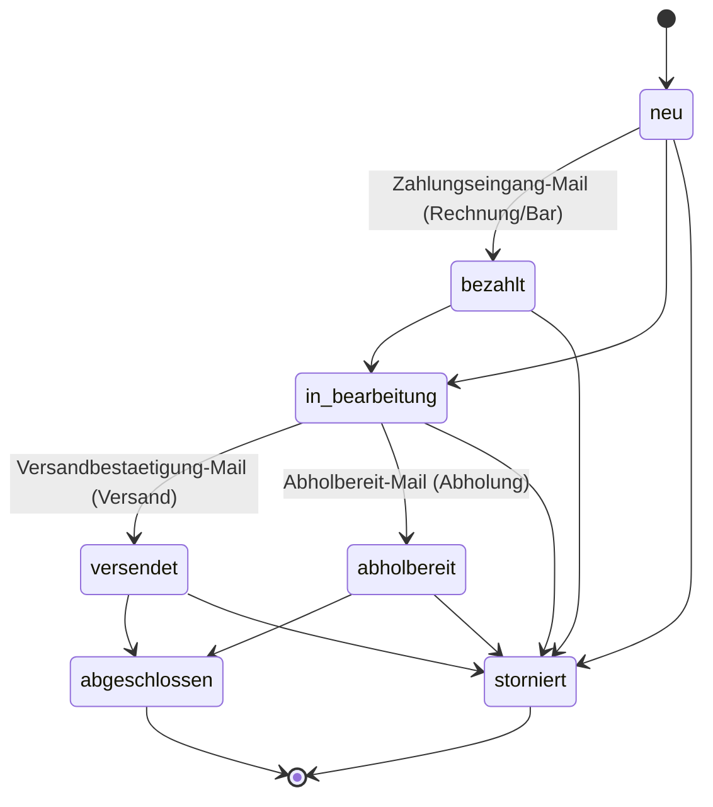
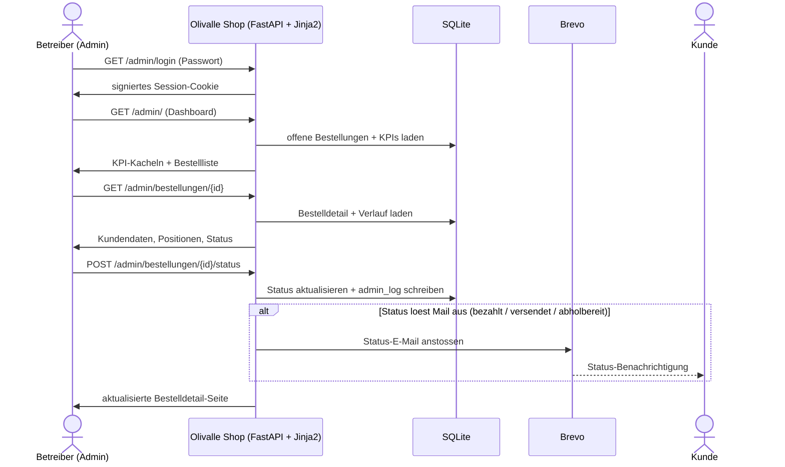
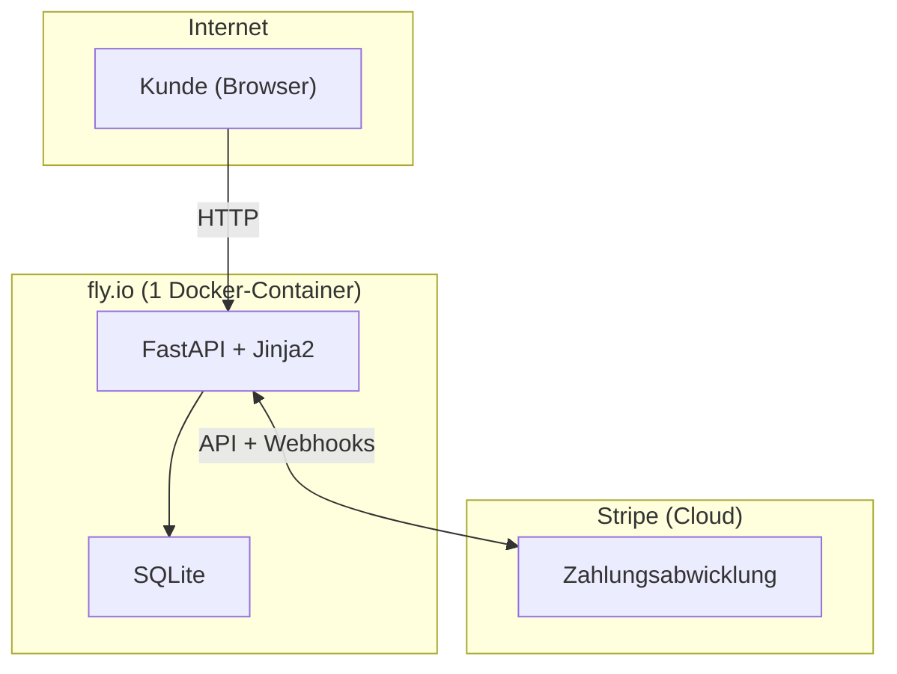
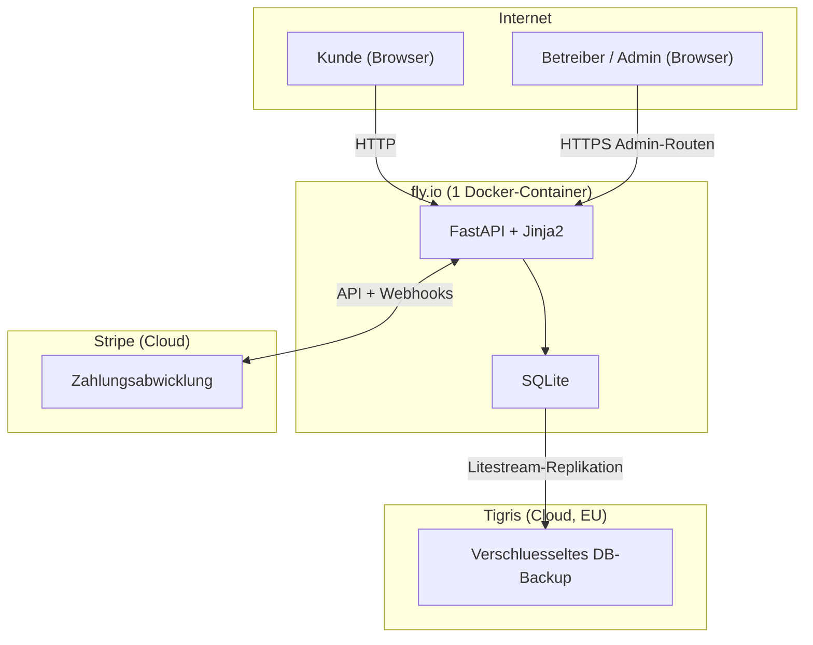

# Restliche Doku-Lücken #144 — Implementation Plan

> **For agentic workers:** REQUIRED SUB-SKILL: Use superpowers:subagent-driven-development (recommended) or superpowers:executing-plans to implement this plan task-by-task. Steps use checkbox (`- [ ]`) syntax for tracking.

**Goal:** Punkte 1, 4, 5 aus Sammel-Issue #144 umsetzen — Lebensmittel-Deklaration (LIV Art. 39) dokumentieren, Betreiber-/Admin-Sicht in drei Diagrammen ergänzen, Tigris in der Datenschutzerklärung nachtragen.

**Architecture:** Reine Doku-/Template-Änderungen (Markdown + ein Jinja2-Template + `mkdocs.yml` nav). Keine App-Logik. Diagramme als Mermaid in bestehende Doku-Seiten eingebettet.

**Tech Stack:** MkDocs Material, Mermaid (mermaid2-Plugin), Jinja2-Template, pytest.

## Global Constraints

- Verifikationsgate vor jedem Commit: `uv run --extra docs mkdocs build --strict` MUSS sauber sein (tote Links / fehlende nav-Ziele).
- Jedes neue/geänderte Mermaid-Diagramm zusätzlich separat auf Syntax validieren (mkdocs --strict prüft KEINE Mermaid-Syntax).
- **Mermaid-Regeln:** kein `\n` in Node-Labels; kein `@` in Kanten-Labels (Mermaid v11 `LINK_ID`-Parse-Error, vgl. commit `00a1ab6`). Sonderzeichen wie `*` in Kanten-Labels meiden.
- Commit-Präfix `docs:`. Branch: `docs/issue-144-restliche-doku-luecken` (bereits aktiv).
- Legal-Texte (Task 1 + Task 2) im PR/Issue als „mit SH gegenlesen" markieren.
- Quelle der Wahrheit Status-Logik: `templates/admin/bestellung_detail.html` (`normalTransitions`) + `app/services/email_service.py` (`_STATUS_EMAIL_CONFIG`). Nicht raten.

---

### Task 1: Punkt 5 — Tigris in Datenschutzerklärung + SQLite-Drift beheben

**Files:**
- Modify: `docs/legal/datenschutz.md:30-37` (Drittanbieter-Tabelle)
- Modify: `templates/datenschutz.html:66-83` (Live-Tabelle)

**Interfaces:**
- Produces: konsistente Anbieter-Liste in Doku & Live: Stripe · Brevo · fly.io · **Tigris** (kein SQLite als „Drittanbieter").

- [ ] **Step 1: `docs/legal/datenschutz.md` — Tabelle ersetzen**

Aktuell (Zeilen 30-37):
```markdown
| Anbieter | Zweck | Standort |
|---|---|---|
| **Stripe** | Zahlungsabwicklung (Twint, Kreditkarte) | USA / EU |
| **SQLite** | Datenbank (Bestellungen, Kundendaten) | lokal (fly.io, EU) |
| **Brevo** (ehem. Sendinblue) | E-Mail-Versand (Bestellbestätigungen) | Frankreich (EU) |
| **fly.io** | Hosting des Webshops | EU |

Diese Anbieter verarbeiten Daten in unserem Auftrag und sind vertraglich zur Einhaltung angemessener Datenschutzstandards verpflichtet. Es findet keine Weitergabe Ihrer Daten an sonstige Dritte statt.
```

Neu:
```markdown
| Anbieter | Zweck | Standort |
|---|---|---|
| **Stripe** | Zahlungsabwicklung (Twint, Kreditkarte) | USA / EU |
| **Brevo** (ehem. Sendinblue) | E-Mail-Versand (Bestellbestätigungen) | Frankreich (EU) |
| **fly.io** | Hosting des Webshops | EU |
| **Tigris** | Verschlüsseltes Datenbank-Backup (Bestelldaten, via Litestream) | EU (Amsterdam, Frankfurt) |

Ihre Bestelldaten werden in einer SQLite-Datenbank gespeichert, die lokal auf der fly.io-Infrastruktur läuft — kein separater externer Dienst, sondern Teil des oben genannten Hostings.

Diese Anbieter verarbeiten Daten in unserem Auftrag und sind vertraglich zur Einhaltung angemessener Datenschutzstandards verpflichtet. Es findet keine Weitergabe Ihrer Daten an sonstige Dritte statt.
```

- [ ] **Step 2: `templates/datenschutz.html` — Tigris-Zeile + SQLite-Satz**

Die fly.io-Zeile (`<tr>` ohne Klasse, Zeilen 77-81) bekommt eine untere Trennlinie, danach folgt die neue Tigris-Zeile. Ersetze den Block:
```html
                        <tr>
                            <td class="py-2 pr-4">fly.io</td>
                            <td class="py-2 pr-4">Hosting des Webshops</td>
                            <td class="py-2">EU</td>
                        </tr>
                    </tbody>
```
durch:
```html
                        <tr class="border-b border-stone-700">
                            <td class="py-2 pr-4">fly.io</td>
                            <td class="py-2 pr-4">Hosting des Webshops</td>
                            <td class="py-2">EU</td>
                        </tr>
                        <tr>
                            <td class="py-2 pr-4">Tigris</td>
                            <td class="py-2 pr-4">Verschlüsseltes Datenbank-Backup (Bestelldaten, via Litestream)</td>
                            <td class="py-2">EU (Amsterdam, Frankfurt)</td>
                        </tr>
                    </tbody>
```
Direkt NACH dem `</table>`-Tag (Zeile 83) und VOR dem bestehenden `<p ...>Diese Anbieter verarbeiten Daten…` einen neuen Absatz einfügen:
```html
            <p class="text-stone-200 leading-relaxed mt-4 text-justify">
                Ihre Bestelldaten werden in einer SQLite-Datenbank gespeichert, die lokal auf
                der fly.io-Infrastruktur läuft — kein separater externer Dienst, sondern Teil
                des oben genannten Hostings.
            </p>
```

- [ ] **Step 3: Verifikation — Build + Template-Render**

Run: `uv run --extra docs mkdocs build --strict`
Expected: `INFO - Documentation built` ohne WARNING/ERROR.

Run: `make test`
Expected: alle Tests grün (stellt sicher, dass `datenschutz.html` weiterhin fehlerfrei rendert, falls ein Route-Test existiert).

- [ ] **Step 4: Commit**

```bash
git add docs/legal/datenschutz.md templates/datenschutz.html
git commit -m "docs: Tigris als Auftragsverarbeiter in Datenschutz ergaenzen, SQLite-Drift beheben (#144)"
```

---

### Task 2: Punkt 1 — Lebensmittel-Deklaration (LIV Art. 39)

**Files:**
- Create: `docs/legal/lebensmittel-deklaration.md`
- Modify: `mkdocs.yml:49-52` (nav, Abschnitt „Rechtliches")

**Interfaces:**
- Produces: neue nav-Seite `legal/lebensmittel-deklaration.md` unter „Rechtliches".

- [ ] **Step 1: Neue Seite anlegen**

Inhalt von `docs/legal/lebensmittel-deklaration.md` (Werte verbatim aus `templates/ueber-das-oel.html`):
```markdown
[← Übersicht](../index.md)

# Lebensmittel-Deklaration (LIV Art. 39)

> **Rechtlicher Hinweis:** Dieser Compliance-Nachweis ist mit dem Stakeholder (Inhaber) gegenzulesen.

**Zweck.** Olivalle verkauft ein vorverpacktes Lebensmittel (natives Olivenöl extra) im Fernabsatz. Die Schweizer Lebensmittelinformationsverordnung (LIV) verlangt sinngemäss, dass die kennzeichnungspflichtigen Pflichtangaben den Kundinnen und Kunden bereits vor Abschluss des Kaufs zugänglich sind. Diese Seite hält fest, welche Pflichtangaben umgesetzt sind, wo sie live stehen und auf welcher Rechtsgrundlage.

## Umgesetzte Pflichtangaben

| Pflichtangabe | Umsetzung |
|---|---|
| Sachbezeichnung | „Natives Olivenöl extra (biologisch)" |
| Güteklasse / Beschreibung | „Olivenöl höchster Qualität, direkt aus Oliven ausschliesslich mit mechanischen Verfahren gewonnen." |
| Nährwertdeklaration (pro 100 g) | Energie, Fett (davon gesättigte Fettsäuren), Kohlenhydrate (davon Zucker), Eiweiss, Salz, Vitamin E |
| Lagerhinweis | „Kühl und dunkel lagern, vor Licht schützen." |

## Wo live

Alle Angaben stehen auf der öffentlichen Produktseite **„Unser Olivenöl"** (`templates/ueber-das-oel.html`, Abschnitte „Produktinformation" und „Nährwerte pro 100 g"). Die Seite ist ohne Login und vor jedem Kaufabschluss frei zugänglich.

## Rechtsgrundlage

- **LIV** (Verordnung des EDI betreffend die Information über Lebensmittel), **Art. 39** — Fernabsatz: Pflichtangaben müssen vor dem Kaufabschluss verfügbar sein.
- Sachbezeichnung „Natives Olivenöl extra" entspricht der höchsten Güteklasse gemäss den Vermarktungsnormen für Olivenöl.

## Mit SH zu klären / Vollständigkeit

- **Loskennzeichnung & Mindesthaltbarkeitsdatum** stehen auf dem physischen Etikett der Flasche (chargenabhängig, online nicht sinnvoll abbildbar) — zur Vollständigkeit hier vermerkt.
- **Allergene:** Olivenöl enthält keine deklarationspflichtigen Allergene — kein Hinweis erforderlich.
```

- [ ] **Step 2: nav ergänzen**

In `mkdocs.yml` den „Rechtliches"-Block ersetzen:
```yaml
  - Rechtliches:
    - AGB: legal/agb.md
    - Datenschutz: legal/datenschutz.md
    - Impressum: legal/impressum.md
```
durch:
```yaml
  - Rechtliches:
    - AGB: legal/agb.md
    - Datenschutz: legal/datenschutz.md
    - Lebensmittel-Deklaration: legal/lebensmittel-deklaration.md
    - Impressum: legal/impressum.md
```

- [ ] **Step 3: Verifikation**

Run: `uv run --extra docs mkdocs build --strict`
Expected: `Documentation built` ohne WARNING/ERROR (insb. kein „page exists in docs but not in nav" und kein toter Link `../index.md`).

- [ ] **Step 4: Commit**

```bash
git add docs/legal/lebensmittel-deklaration.md mkdocs.yml
git commit -m "docs: Lebensmittel-Deklaration LIV Art. 39 als Compliance-Nachweis dokumentieren (#144)"
```

---

### Task 3: Punkt 4 / C1 — Zustandsdiagramm Bestellstatus (arc42 §5.2)

**Files:**
- Modify: `docs/arc42.md:212` (nach dem Absatz „**Bestellstatus.** …")

**Interfaces:**
- Consumes: Status-Übergänge aus `normalTransitions`, Mail-Trigger aus `_STATUS_EMAIL_CONFIG`.

- [ ] **Step 1: Diagramm + Notiz einfügen**

Direkt NACH dem bestehenden Absatz `**Bestellstatus.** … (z. B. \`zahlungseingang\`, \`versandbestaetigung\`, \`abholbereit\`).` (Zeile 212) und VOR dem Absatz `**Audit-Log.**` (Zeile 214) einfügen:

````markdown



*Lesehinweis:* Bei Zahlungsart Stripe wird `bezahlt` automatisch per Webhook gesetzt (keine separate Zahlungseingangs-Mail, da die Bestätigung bereits beim Kauf verschickt wurde). Bei **Rechnung / Bar bei Abholung** setzt der Betreiber `bezahlt` und den Versand-/Abholschritt manuell; ihre Reihenfolge ist nicht fix (Stammkunde zahlt ggf. zuerst, Neukunde erhält die Ware erst nach Zahlung). Jeder Status kann nach `storniert` wechseln.
````

- [ ] **Step 2: Mermaid-Syntax validieren**

Validiere den `stateDiagram-v2`-Block separat (Mermaid-Chart-Validator / `mcp__claude_ai_Mermaid_Chart__validate_and_render_mermaid_diagram`).
Expected: rendert ohne Parse-Error; keine `@`-/`\n`-Vorkommen in Labels.

- [ ] **Step 3: Build-Gate**

Run: `uv run --extra docs mkdocs build --strict`
Expected: ohne WARNING/ERROR.

- [ ] **Step 4: Commit**

```bash
git add docs/arc42.md
git commit -m "docs: Zustandsdiagramm Bestellstatus in arc42 §5.2 ergaenzen (#144)"
```

---

### Task 4: Punkt 4 / C2 — Admin-Sequenzdiagramm (bestellprozess.md)

**Files:**
- Modify: `docs/bestellprozess.md` (neuer Abschnitt „Betreibersicht" am Dateiende)

**Interfaces:**
- Consumes: Admin-Routen aus arc42 §5.2 (Login, Dashboard, Bestelldetail, Statuswechsel).

- [ ] **Step 1: Abschnitt anhängen**

Am ENDE von `docs/bestellprozess.md` anfügen:

````markdown

---

## Betreibersicht — eingehende Bestellung verarbeiten

**Zweck:** Spiegelbild zum Kunden-Sequenzdiagramm — der Ablauf aus Sicht des Betreibers (Stakeholder/Admin), der eine eingegangene Bestellung im Admin-Bereich bearbeitet und damit eine Status-E-Mail an den Kunden auslöst.



**Die Schritte im Einzelnen:**

- **Login** — der Betreiber meldet sich mit einem Passwort an (`POST /admin/login`); bei Erfolg gibt der Shop ein signiertes Session-Cookie aus.
- **Dashboard** — `GET /admin/` zeigt KPI-Kacheln (offene Bestellungen, Monatsumsatz, Bestellungen heute) und die filterbare Bestellliste.
- **Bestelldetail** — `GET /admin/bestellungen/{id}` öffnet Kundendaten, Positionen und den bisherigen Verlauf.
- **Statuswechsel** — `POST /admin/bestellungen/{id}/status` ändert den Status, schreibt einen Eintrag ins `admin_log` und löst — sofern der Zielstatus eine Mail vorsieht (`bezahlt`, `versendet`, `abholbereit`) — automatisch die passende Kunden-E-Mail über Brevo aus.
````

- [ ] **Step 2: Mermaid-Syntax validieren**

Validiere den `sequenceDiagram`-Block separat.
Expected: rendert ohne Parse-Error; keine `@`-/`\n`-Vorkommen in Labels.

- [ ] **Step 3: Build-Gate**

Run: `uv run --extra docs mkdocs build --strict`
Expected: ohne WARNING/ERROR.

- [ ] **Step 4: Commit**

```bash
git add docs/bestellprozess.md
git commit -m "docs: Admin-Sequenzdiagramm (Betreibersicht) in bestellprozess.md ergaenzen (#144)"
```

---

### Task 5: Punkt 4 / C3 — Verteilungssicht §7 um SH/Admin + Tigris erweitern

**Files:**
- Modify: `docs/arc42.md:230-246` (Mermaid `graph TD`)
- Modify: `docs/arc42.md:249-253` (Hosting-Kosten-Tabelle — Tigris-Zeile)

**Interfaces:**
- Consumes: Tigris-Standort aus `adr-backup-strategie.md` (EU, Amsterdam + Frankfurt, Free Tier).

- [ ] **Step 1: Diagramm ersetzen**

Ersetze den bestehenden `graph TD`-Block:

durch:


- [ ] **Step 2: Hosting-Kosten-Tabelle ergänzen**

In der Tabelle „Hosting-Kosten (geschätzt)" nach der Brevo-Zeile ergänzen:
```markdown
| Tigris (Backup) | Gratis (Free Tier 10 GB; DB ~10 MB) | Ab 10 GB Backup-Volumen |
```

- [ ] **Step 3: Mermaid-Syntax validieren**

Validiere den `graph TD`-Block separat. Achte besonders auf die Kanten-Labels (kein `@`, kein `*`, kein `\n`).
Expected: rendert ohne Parse-Error.

- [ ] **Step 4: Build-Gate**

Run: `uv run --extra docs mkdocs build --strict`
Expected: ohne WARNING/ERROR.

- [ ] **Step 5: Commit**

```bash
git add docs/arc42.md
git commit -m "docs: Verteilungssicht §7 um SH/Admin-Akteur und Tigris-Backup erweitern (#144)"
```

---

### Task 6: Abschluss — Drift-Checks, Gesamt-Build, Issue-Update

**Files:**
- Check (ggf. Modify): `docs/user-stories-testplan.md`
- Check (ggf. Modify): `docs/index.md`

- [ ] **Step 1: Testplan gegenchecken**

Prüfe `docs/user-stories-testplan.md` auf Bezüge zur Anbieter-Liste / zum Bestellstatus. Erwartung: keine Änderung nötig (reine Doku/Legal-Texte). Falls eine Story die Datenschutz-Anbieter oder Statusliste konkret aufzählt → konsistent nachziehen.

- [ ] **Step 2: index.md prüfen**

Prüfe `docs/index.md`, ob der „rote Faden" eine Erwähnung der neuen Legal-Seite (Lebensmittel-Deklaration) sinnvoll macht. Falls dort eine Liste der Rechtsdokumente existiert → Seite einreihen. Sonst keine Änderung.

- [ ] **Step 3: Gesamt-Verifikation**

Run: `uv run --extra docs mkdocs build --strict`
Expected: sauber.

Run: `make test`
Expected: alle Tests grün.

- [ ] **Step 4: Commit (nur falls Step 1/2 etwas geändert haben)**

```bash
git add docs/user-stories-testplan.md docs/index.md
git commit -m "docs: Testplan/Index-Konsistenz nach #144-Ergaenzungen"
```

- [ ] **Step 5: PR + Issue**

- PR erstellen mit Hinweis: „Legal-Texte (Datenschutz/Tigris, Lebensmittel-Deklaration) **mit SH gegenlesen**."
- Issue #144: Punkte 1, 4, 5 als erledigt abhaken; Punkte 2 (`/health` version) und 3 (Specs-Sichtbarkeit) ausdrücklich als **offen / vertagt** belassen.

---

## Self-Review

**Spec coverage:**
- Punkt 5 (Tigris/DSG, SQLite-Drift, beide Stellen) → Task 1 ✓
- Punkt 1 (LIV Art. 39, neue Seite + nav) → Task 2 ✓
- Punkt 4 C1 (Zustandsdiagramm §5.2) → Task 3 ✓
- Punkt 4 C2 (Admin-Sequenz) → Task 4 ✓
- Punkt 4 C3 (§7 SH/Admin + Tigris) → Task 5 ✓
- SH-Gegenlese-Markierung, Testplan-/Index-Check, Issue-Update → Task 1/2 + Task 6 ✓
- Vertagt (Punkt 2 + 3) bewusst NICHT umgesetzt, in Task 6 dokumentiert ✓

**Placeholder scan:** keine TBD/TODO; alle Diagramme und Texte ausformuliert.

**Type/Naming consistency:** Status-Namen (`neu/bezahlt/in_bearbeitung/versendet/abholbereit/abgeschlossen/storniert`) und Mail-Trigger (`bezahlt/versendet/abholbereit`) konsistent zwischen Task 3, 4 und Quelle. Anbieter-Liste (Stripe/Brevo/fly.io/Tigris) konsistent zwischen Task 1 und Task 5.
