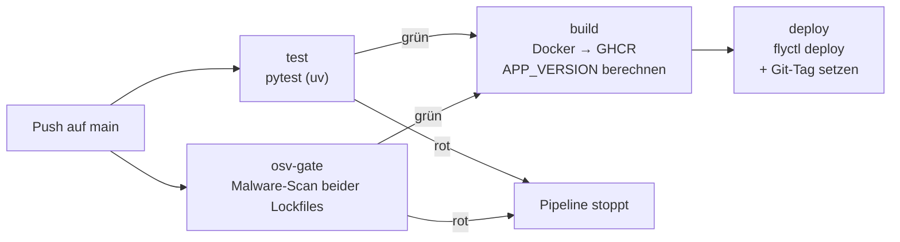

# OSV-Malware-Gate + PR-Vorlage (Issue #179) Implementation Plan

> **For agentic workers:** REQUIRED SUB-SKILL: Use superpowers:subagent-driven-development (recommended) or superpowers:executing-plans to implement this plan task-by-task. Steps use checkbox (`- [ ]`) syntax for tracking.

**Goal:** Malicious-Package-Gate (osv-scanner + Filter-Skript) in die Deploy-Pipeline einbauen und eine PR-Vorlage mit Lockfile-Diff-Review-Punkt anlegen.

**Architecture:** Neuer Job `osv-gate` in `deploy.yml` lädt osv-scanner v2.4.0 (sha256-verifiziert), scannt beide Lockfiles in einem Aufruf und filtert den JSON-Report mit `scripts/ci/osv_malware_gate.py` (1:1 aus Munica) auf `MAL-*`-Einträge. `build` erhält `needs: [test, osv-gate]`. Spec: `docs/superpowers/specs/2026-07-10-issue179-osv-gate-design.md`.

**Tech Stack:** GitHub Actions, osv-scanner v2.4.0, Python stdlib, pytest.

## Global Constraints

- osv-scanner exakt **v2.4.0**, Binary-Hash statisch eingebettet: `15314940c10d26af9c6649f150b8a47c1262e8fc7e17b1d1029b0e479e8ed8a0` (linux_amd64, aus offizieller `osv-scanner_SHA256SUMS` v2.4.0)
- Exit-Code-Muster: Scanner-exit 1 = Findings (normal, filtern); > 1 = fail closed
- Beide Lockfiles scannen: `uv.lock` **und** `package-lock.json` (beide getrackt, verifiziert)
- Neuer Job nur `permissions: contents: read` (Least Privilege)
- `uses:`-Zeilen auf 40-stellige SHAs gepinnt mit `# vX.Y.Z`-Kommentar
- Gate-Skript-Logik nicht verändern — kanonische Quelle ist Munica (`../Munica/scripts/ci/osv_malware_gate.py`), nur Docstring/Header anpassen
- Commit-Präfixe: `feat:`, `fix:`, `docs:`, `refactor:`, `test:`

---

### Task 1: Gate-Skript + Tests übernehmen

**Files:**
- Create: `tests/test_osv_malware_gate.py` (aus `../Munica/tests/test_osv_malware_gate.py`)
- Create: `scripts/ci/osv_malware_gate.py` (aus `../Munica/scripts/ci/osv_malware_gate.py`)

**Interfaces:**
- Produces: CLI `python3 scripts/ci/osv_malware_gate.py <report.json>` — Exit 0 = sauber, ≠ 0 = blockieren. Funktion `malware_findings(report: dict) -> list[tuple[str, str, str]]`. Task 2 (Workflow) und Task 5 (lokale Verifikation) rufen die CLI auf.

- [ ] **Step 1: Tests kopieren (Header anpassen) und Fehlschlag verifizieren**

Datei `tests/test_osv_malware_gate.py` = 1:1-Kopie von `../Munica/tests/test_osv_malware_gate.py`, nur der Modul-Docstring (Zeile 1) wird ersetzt durch:

```python
"""Tests für das OSV-Malware-CI-Gate (scripts/ci/osv_malware_gate.py, #179).

1:1 aus Munica übernommen (munica#192) — Weiterentwicklung passiert dort.
"""
```

Run: `uv run pytest tests/test_osv_malware_gate.py -v`
Expected: FAIL/ERROR beim Import (`ModuleNotFoundError: osv_malware_gate`)

- [ ] **Step 2: Gate-Skript kopieren (Docstring anpassen)**

Datei `scripts/ci/osv_malware_gate.py` = 1:1-Kopie von `../Munica/scripts/ci/osv_malware_gate.py`, nur der Modul-Docstring wird ersetzt durch (Code ab `from __future__ …` unverändert):

```python
"""CI-Gate: bricht nur bei Malicious-Package-Einträgen im osv-scanner-Report (#179).

1:1 aus Munica übernommen (munica#192, dort mit 11 Tests abgesichert) —
kanonische Quelle und Weiterentwicklung liegen in Munica.

Liest einen mit `osv-scanner scan --format json` erzeugten Report und schlägt
ausschliesslich bei OSV-Einträgen mit Prefix ``MAL-`` an (OpenSSF Malicious
Packages) — direkt oder als Alias. Normale Vulnerabilities brechen den Build
bewusst nicht (sonst wäre die CI ab der ersten Dev-Dep-CVE dauerrot).

Aufruf: python3 scripts/ci/osv_malware_gate.py <report.json>
Exit 0 = sauber; Exit != 0 = blockieren (fehlende/kaputte Datei wirft = fail closed).
"""
```

- [ ] **Step 3: Tests grün verifizieren**

Run: `uv run pytest tests/test_osv_malware_gate.py -v`
Expected: 11 passed

- [ ] **Step 4: Lint**

Run: `make lint-all`
Expected: sauber (sonst `uv run ruff format scripts/ci/osv_malware_gate.py tests/test_osv_malware_gate.py` und erneut prüfen — Logik nicht ändern)

- [ ] **Step 5: Commit**

```bash
git add scripts/ci/osv_malware_gate.py tests/test_osv_malware_gate.py
git commit -m "feat: OSV-Malware-Gate-Skript aus Munica übernehmen (#179)"
```

---

### Task 2: Job `osv-gate` in deploy.yml

**Files:**
- Modify: `.github/workflows/deploy.yml` (neuer Job nach `test`, `build.needs` erweitern)

**Interfaces:**
- Consumes: CLI aus Task 1 (`python3 scripts/ci/osv_malware_gate.py /tmp/osv.json`)
- Produces: Job-ID `osv-gate`, von `build` via `needs: [test, osv-gate]` referenziert

- [ ] **Step 1: Job einfügen**

In `.github/workflows/deploy.yml` direkt nach dem `test`-Job (nach Zeile `        run: uv run pytest`) einfügen:

```yaml

  # Supply-Chain-Guard (#179): blockt nur OSV-Einträge mit Prefix MAL-
  # (OpenSSF Malicious Packages) in beiden Lockfiles. Normale Vulns brechen
  # den Build bewusst nicht (sonst ab der ersten Dev-Dep-CVE dauerrot).
  # Version gepinnt — ein Supply-Chain-Guard zieht sich nicht von "latest".
  osv-gate:
    name: OSV Malware Gate
    runs-on: ubuntu-latest
    permissions:
      contents: read  # Least Privilege: Job führt ein fremdes Binary aus
    steps:
      - uses: actions/checkout@9c091bb21b7c1c1d1991bb908d89e4e9dddfe3e0  # v7.0.0

      - name: OSV malware scan (uv.lock + package-lock.json)
        run: |
          curl -sSfL -o /tmp/osv-scanner \
            https://github.com/google/osv-scanner/releases/download/v2.4.0/osv-scanner_linux_amd64
          chmod +x /tmp/osv-scanner
          # Inhalt verifizieren, nicht nur den Tag: Release-Assets sind für einen
          # bestehenden Tag austauschbar (Hash aus osv-scanner_SHA256SUMS v2.4.0).
          echo "15314940c10d26af9c6649f150b8a47c1262e8fc7e17b1d1029b0e479e8ed8a0  /tmp/osv-scanner" | sha256sum -c -
          ec=0
          /tmp/osv-scanner scan --lockfile=uv.lock --lockfile=package-lock.json \
            --format json > /tmp/osv.json || ec=$?
          # exit 1 = "Findings vorhanden" (normal, wird unten gefiltert);
          # alles > 1 = echter Scanner-Fehler -> fail closed.
          if [ "$ec" -gt 1 ]; then
            echo "osv-scanner fehlgeschlagen (exit $ec)"; exit "$ec"
          fi
          python3 scripts/ci/osv_malware_gate.py /tmp/osv.json
```

- [ ] **Step 2: `build`-Job gate'n**

In `.github/workflows/deploy.yml` beim `build`-Job ändern:

```yaml
    needs: test
```
→
```yaml
    needs: [test, osv-gate]
```

- [ ] **Step 3: YAML-Syntax prüfen**

Run: `uv run python -c "import yaml, sys; yaml.safe_load(open('.github/workflows/deploy.yml')); print('YAML OK')"`
Expected: `YAML OK` (PyYAML ist transitiv vorhanden; falls nicht: `python3 -c` mit `tomllib`-freier Prüfung entfällt — dann Review des Diffs genügt)

- [ ] **Step 4: Commit**

```bash
git add .github/workflows/deploy.yml
git commit -m "feat: OSV-Malware-Gate-Job in Deploy-Pipeline (#179)"
```

---

### Task 3: PR-Vorlage mit Lockfile-Diff-Review-Punkt

**Files:**
- Create: `.github/PULL_REQUEST_TEMPLATE.md`

- [ ] **Step 1: Vorlage anlegen**

Inhalt (aus Munica, an olivalle angepasst: `make`-Targets, beide Lockfiles):

```markdown
## Beschreibung

<!-- Was ändert dieser PR? Issue-Referenz: Closes #XX -->

## Checkliste

- [ ] Tests grün (`make test`) und Lint sauber (`make lint-all`)
- [ ] Doku konsistent mit der Änderung (README, `docs/` inkl. arc42, `.env.example`)
- [ ] **Lockfile-Diff geprüft:** Änderungen an `uv.lock`/`pyproject.toml` bzw. `package-lock.json`/`package.json` bewusst gewählt — Paketname exakt richtig (kein Typosquat auf ein echtes altes Paket), Quelle plausibel
- [ ] Keine Secrets im Diff
```

- [ ] **Step 2: Commit**

```bash
git add .github/PULL_REQUEST_TEMPLATE.md
git commit -m "docs: PR-Vorlage mit Lockfile-Diff-Review-Punkt (#179)"
```

---

### Task 4: Doku-Abgleich (security.md + ci-cd-und-versionierung.md)

**Files:**
- Modify: `docs/security.md` (Bullet in Schutzmassnahmen + neuer Abschnitt)
- Modify: `docs/ci-cd-und-versionierung.md` (Pipeline-Graph, Job-Liste, Text „drei Jobs")

- [ ] **Step 1: security.md ergänzen**

In der Liste „Vorhandene Schutzmaßnahmen" nach dem `Fail-Fast-Konfigcheck`-Bullet einfügen:

```markdown
- **Supply-Chain-Schutz:** dreischichtig — dep-guard-Hook (Entwicklungszeit), OSV-Malware-Gate in der CI, Lockfile-Diff-Punkt in der PR-Vorlage (siehe [Supply-Chain-Schutz](#supply-chain-schutz-issue-179)).
```

Am Dateiende neuen Abschnitt anfügen:

```markdown

## Supply-Chain-Schutz (Issue #179)

**Stand:** 2026-07-10

Drei Schichten gegen kompromittierte oder halluzinierte Dependencies
(Slopsquatting) — jede fängt einen anderen Fall, keine ersetzt die andere:

| Schicht | Fängt | Wo |
|---|---|---|
| **dep-guard-Hook** (PreToolUse, user-scope) | halluzinierte Namen, frisch registrierte Squats, Einmal-Upload-Payloads — geprüft gegen echte PyPI/npm-Metadaten | `~/.claude/hooks/dep_guard.py` (repo-übergreifend, nicht Teil dieses Repos) |
| **OSV-Malware-Gate** (CI) | legitime Pakete, die *nachträglich* kompromittiert wurden, inkl. transitiver Dependencies | Job `osv-gate` in `deploy.yml` + `scripts/ci/osv_malware_gate.py` |
| **Lockfile-Diff im Review** | Typosquatting auf echte alte Pakete (z. B. `python-dateutils`) — für Hook und OSV unsichtbar | `.github/PULL_REQUEST_TEMPLATE.md` |

Das CI-Gate scannt beide Lockfiles (`uv.lock`, `package-lock.json`) mit
osv-scanner **v2.4.0** (Version gepinnt **und** Binary sha256-verifiziert —
Release-Assets sind für einen bestehenden Tag austauschbar) und bricht nur
bei OSV-Einträgen mit Prefix `MAL-` (OpenSSF Malicious Packages, geprüft in
ID und Aliases). Normale Vulnerabilities brechen den Build bewusst nicht.
Fail closed: Scanner-Fehler, fehlendes Lockfile oder Format-Drift im Report
blockieren das Deployment. Gate-Skript und Tests sind 1:1 aus Munica
übernommen (munica#192) — Weiterentwicklung passiert dort.
```

- [ ] **Step 2: ci-cd-und-versionierung.md anpassen**

Text „Er besteht aus drei aufeinander aufbauenden Jobs:" → „Er besteht aus vier Jobs:". Mermaid-Graph ersetzen durch:



Nach dem `test`-Bullet einfügen:

```markdown
- **`osv-gate`** — lädt osv-scanner v2.4.0 (sha256-verifiziert), scannt `uv.lock` + `package-lock.json` und blockt via `scripts/ci/osv_malware_gate.py` nur Malicious-Package-Einträge (`MAL-*`). Details: [Security-Notizen](security.md#supply-chain-schutz-issue-179).
```

`build`-Bullet: „(`build` hat `needs: test`)" → „(`build` hat `needs: [test, osv-gate]`)". In der Workflow-Tabelle die `deploy.yml`-Zeile anpassen: „Test → Build → Deploy" → „Test + OSV-Gate → Build → Deploy".

- [ ] **Step 3: MkDocs-Gate**

Run: `uv run mkdocs build --strict`
Expected: Build ohne Warnungen/Fehler

- [ ] **Step 4: Commit**

```bash
git add docs/security.md docs/ci-cd-und-versionierung.md
git commit -m "docs: Supply-Chain-Schutz dokumentieren (#179)"
```

---

### Task 5: Lokale End-to-End-Verifikation gegen echte Lockfiles

**Files:** keine (Scratchpad-only, kein Commit) — Nachweis für DoD/Issue-Close.

**Interfaces:**
- Consumes: CLI aus Task 1, beide echten Lockfiles im Repo-Root

- [ ] **Step 1: darwin_arm64-Binary laden und Hash gegen offizielle SHA256SUMS verifizieren**

```bash
cd "$SCRATCHPAD"  # Session-Scratchpad
curl -sSfL -o osv-scanner https://github.com/google/osv-scanner/releases/download/v2.4.0/osv-scanner_darwin_arm64
curl -sSfL -o SHA256SUMS https://github.com/google/osv-scanner/releases/download/v2.4.0/osv-scanner_SHA256SUMS
grep 'osv-scanner_darwin_arm64$' SHA256SUMS | sed 's|osv-scanner_darwin_arm64|osv-scanner|' | shasum -a 256 -c -
chmod +x osv-scanner
```

Expected: `osv-scanner: OK`

- [ ] **Step 2: Kreuzcheck des eingebetteten linux_amd64-Hashes**

```bash
grep 'osv-scanner_linux_amd64$' SHA256SUMS
```

Expected: `15314940c10d26af9c6649f150b8a47c1262e8fc7e17b1d1029b0e479e8ed8a0  osv-scanner_linux_amd64` — muss dem in `deploy.yml` eingebetteten Hash entsprechen.

- [ ] **Step 3: Scan + Gate gegen beide echten Lockfiles**

```bash
cd <repo-root>
ec=0
"$SCRATCHPAD/osv-scanner" scan --lockfile=uv.lock --lockfile=package-lock.json \
  --format json > "$SCRATCHPAD/osv.json" || ec=$?
echo "scanner exit=$ec"   # erwartet 0 oder 1
python3 scripts/ci/osv_malware_gate.py "$SCRATCHPAD/osv.json"; echo "gate exit=$?"
```

Expected: `OSV-Malware-Gate: keine MAL-Eintraege im Report.` und `gate exit=0`. Zusätzlich Paketzahl aus dem Report notieren (Nachweis, dass wirklich beide Lockfiles gescannt wurden — npm- und PyPI-Pakete im selben Report).

---

### Abschluss (nach allen Tasks)

- [ ] Gesamte Suite + Lint: `make test && make lint-all` — grün
- [ ] superpowers:requesting-code-review (Review-Subagent, inkl. Doku-/Secrets-/Commit-Konventions-Check)
- [ ] superpowers:finishing-a-development-branch — Merge nach `main`
- [ ] Issue #179 mit DoD-Nachweis schliessen (Verifikations-Outputs aus Task 5, dep-guard-Block-Test exit=2, Verweis auf global erledigte Teilaufgaben)
- [ ] Post-Issue-Housekeeping: Labels/Abhängigkeiten, README/Doku-Konsistenz, Branches in Sync, Memory aktualisieren
