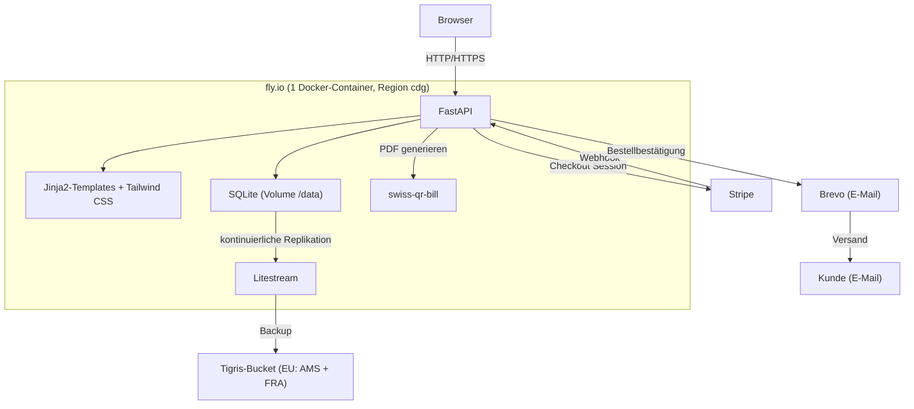

[← Übersicht](index.md)

# Olivalle — Systemarchitektur

**Zweck:** Dieses Diagramm zeigt, wie die Komponenten der Olivalle-Anwendung und die externen Dienste (Stripe, Brevo, Tigris) zusammenspielen — inklusive des kontinuierlichen Backup-Pfads.

**Die Elemente im Einzelnen:**

- **FastAPI** — der Anwendungskern; bedient Shop-Seiten, Checkout, Admin und Stripe-Webhooks.
- **Jinja2 + Tailwind CSS** — server-seitig gerendertes HTML (kein separates Frontend-Framework).
- **SQLite** — eingebettete Datenbank auf dem persistenten fly.io-Volume `/data`.
- **swiss-qr-bill** — erzeugt Schweizer QR-Rechnungs-PDFs für Rechnungskäufer.
- **Litestream → Tigris** — repliziert die SQLite-DB kontinuierlich in einen EU-Bucket (Amsterdam + Frankfurt); beim Volume-Verlust restored der Container automatisch beim Start (siehe `adr-backup-strategie.md`, `runbook-restore.md`).
- **Stripe** — Zahlungsabwicklung (TWINT, Kreditkarte); meldet erfolgreiche Zahlung per Webhook zurück.
- **Brevo** — versendet Bestätigungs-E-Mails von `bestellung@olivalle.ch`; Absender und Reply-To (`olivalle.olten@outlook.com`) sind bewusst fest im Code hinterlegt (`app/services/email_service.py`), **nicht** über ein Secret konfigurierbar (für den Ein-Personen-Betrieb ändern sich die Adressen faktisch nie — eine Änderung erfordert eine Code-Anpassung).
