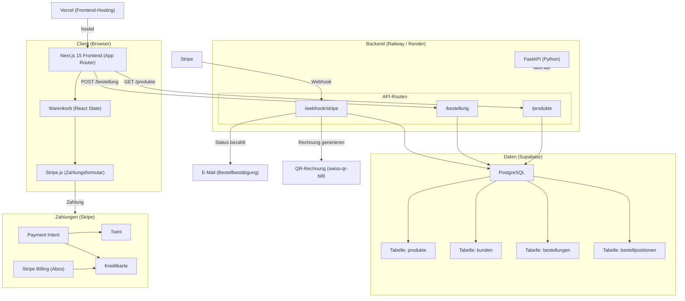

[← Übersicht](index.md)

# Olivalle — Systemarchitektur

```mermaid
graph TD
    subgraph Client["Client (Browser)"]
        UI["Next.js 15 Frontend (App Router)"]
        Cart["Warenkorb (React State)"]
        StripeJS["Stripe.js (Zahlungsformular)"]
    end

    subgraph Backend["Backend (Railway / Render)"]
        API["FastAPI (Python)"]
        subgraph Routes["API-Routen"]
            R1["/produkte"]
            R2["/bestellung"]
            R3["/webhook/stripe"]
        end
    end

    subgraph Data["Daten (Supabase)"]
        DB["PostgreSQL"]
        T1["Tabelle: produkte"]
        T2["Tabelle: kunden"]
        T3["Tabelle: bestellungen"]
        T4["Tabelle: bestellpositionen"]
    end

    subgraph Payments["Zahlungen (Stripe)"]
        PI["Payment Intent"]
        Twint["Twint"]
        Card["Kreditkarte"]
        Billing["Stripe Billing (Abos)"]
    end

    Mail["E-Mail (Bestellbestätigung)"]
    QR["QR-Rechnung (swiss-qr-bill)"]
    Vercel["Vercel (Frontend-Hosting)"]

    UI --> Cart --> StripeJS
    UI -->|GET /produkte| R1
    UI -->|POST /bestellung| R2
    StripeJS -->|Zahlung| Payments
    Stripe -->|Webhook| R3

    R1 --> DB
    R2 --> DB
    R3 --> DB

    DB --> T1 & T2 & T3 & T4

    PI --> Twint & Card
    Billing --> Card

    R3 -->|Status bezahlt| Mail
    R3 -->|Rechnung generieren| QR

    Vercel -->|hostet| UI
    API -->|läuft auf| Backend
```
